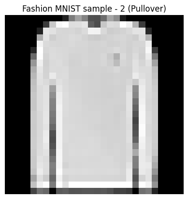
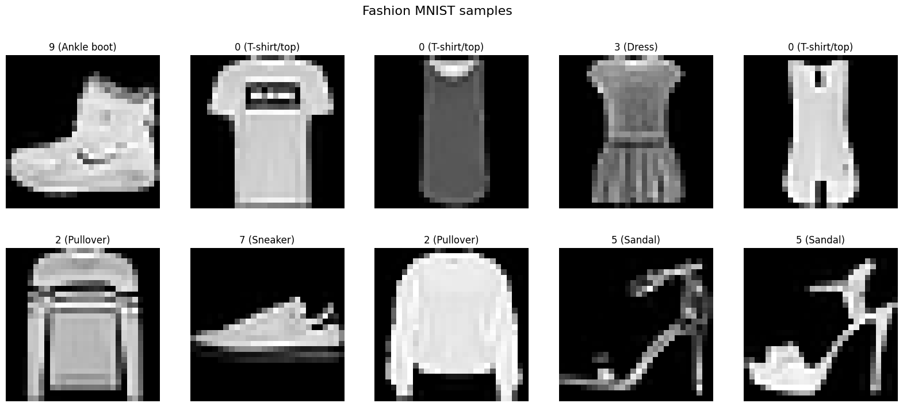
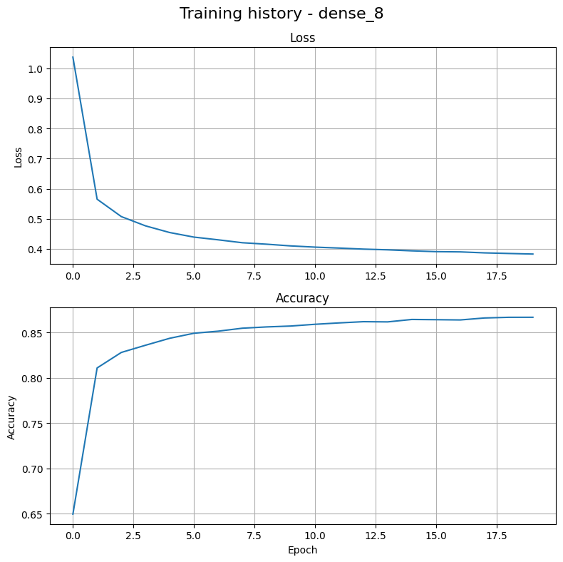
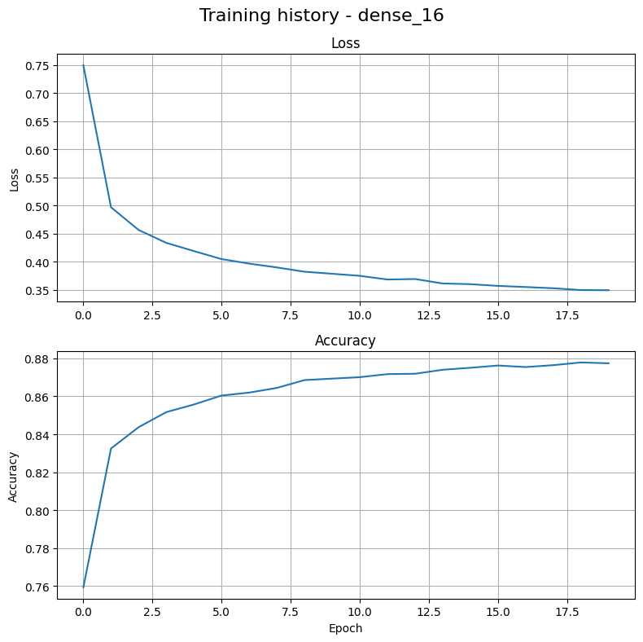
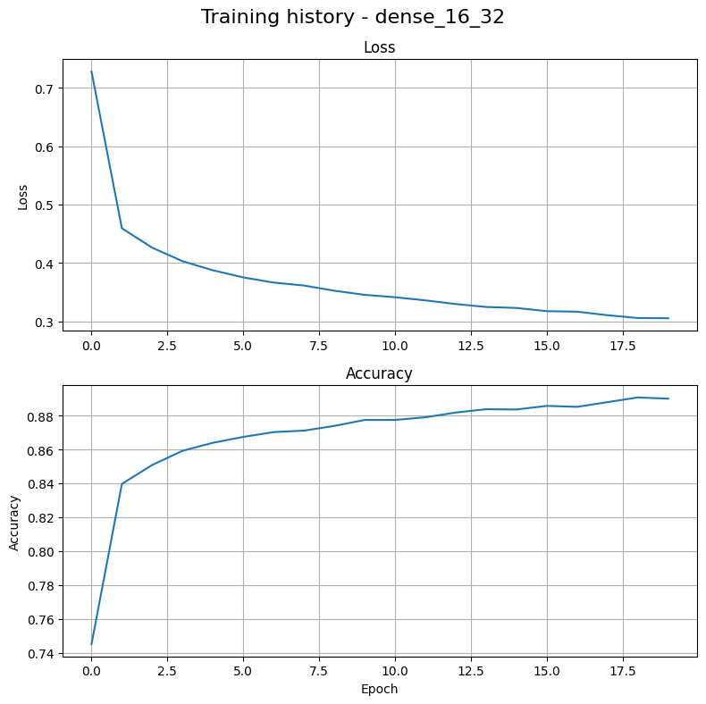
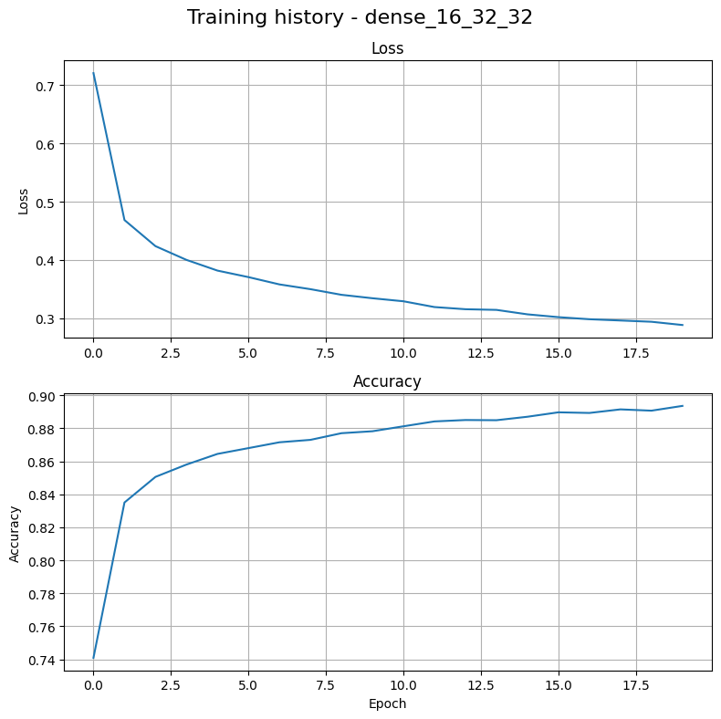

# Fashion MNIST Classification with Different Neural Network Architectures

## Data Visualization

### Single Sample


### Batch of Samples


## Model Architectures Comparison

### Dense [8]


### Dense [16]


### Dense [16, 32]


### Dense [16, 32, 32]


## Results from Console Output
```
Data:
Label: 2 (Pullover)

Image pixel array:
 [[  0   0   0   0   0   0   0   0   0  34 124 161 131  81  79 108 165 141
   28   0   0   0   0   0   0   0   0   0]
 [  0   0   0   0   0   0  61 200 248 255 222 223 230  95  77 199 220 217
  255 239 178  59   0   0   0   0   0   0]
 [  0   0   0   0   0  33 231 225 215 214 215 212 219 244 242 217 205 208
  212 217 227 228  40   0   0   0   0   0]
 [  0   0   0   0   0 173 228 206 214 215 219 217 211 205 203 208 212 214
  215 212 206 222 178   0   0   0   0   0]
 [  0   0   0   0   0 243 218 215 214 215 217 214 214 211 212 213 209 210
  213 209 213 213 239   0   0   0   0   0]
 [  0   0   0   0  38 255 215 219 217 216 214 213 213 210 211 211 213 218
  213 208 215 210 247  59   0   0   0   0]
 [  0   0   0   0 106 253 211 220 218 216 211 211 213 211 212 215 203 175
  218 209 220 207 235 122   0   0   0   0]
 [  0   0   0   0 151 240 208 218 220 215 209 210 214 212 211 214 207 188
  214 210 225 213 225 163   0   0   0   0]
 [  0   0   0   0 174 230 210 219 218 219 211 211 211 210 210 209 211 216
  209 208 225 219 219 190   0   0   0   0]
 [  0   0   0   0 184 226 212 234 219 220 212 212 210 209 210 208 208 210
  209 209 235 223 218 195   0   0   0   0]
 [  0   0   0   0 191 224 218 207 224 218 213 213 211 210 210 208 209 211
  209 214 199 230 218 200   0   0   0   0]
 [  0   0   0   0 196 219 224 158 230 219 214 213 212 210 210 208 208 209
  208 221 141 236 218 204   0   0   0   0]
 [  0   0   0   0 199 219 226 143 237 221 215 214 211 210 209 208 207 209
  209 227 135 237 216 207   0   0   0   0]
 [  0   0   0   0 198 219 226 132 239 220 216 215 212 211 210 209 210 210
  209 227 114 240 214 206   0   0   0   0]
 [  0   0   0   0 198 219 227 129 244 220 216 216 213 211 211 210 210 208
  207 227 100 245 215 207   0   0   0   0]
 [  0   0   0   0 203 216 229 123 242 219 216 215 213 213 213 210 210 207
  210 225  84 247 218 207   0   0   0   0]
 [  0   0   0   0 203 216 230 118 243 217 216 215 214 213 213 210 210 208
  212 222  67 247 219 207   0   0   0   0]
 [  0   0   0   0 202 216 228 106 243 218 218 216 215 213 212 209 210 209
  211 220  77 252 216 208   0   0   0   0]
 [  0   0   0   0 204 217 235  82 242 219 216 216 216 215 214 211 211 211
  211 222  84 250 216 205   0   0   0   0]
 [  0   0   0   0 205 218 237  76 243 219 216 217 217 218 216 213 212 212
  211 223  97 243 219 205   0   0   0   0]
 [  0   0   0   0 205 219 231  83 244 216 218 217 217 218 217 213 211 213
  212 218 136 240 220 203   0   0   0   0]
 [  0   0   0   0 203 220 226  99 246 216 219 218 219 218 217 215 213 214
  211 217 170 234 220 199   0   0   0   0]
 [  0   0   0   0 201 225 220 115 247 216 217 217 217 216 216 217 217 213
  211 218 128 234 225 183   0   0   0   0]
 [  0   0   0   0 201 229 222 128 246 212 217 216 217 217 217 217 217 215
  212 226 126 235 233 171   0   0   0   0]
 [  0   0   0   0 195 236 221 124 252 220 220 219 220 219 218 218 219 218
  213 234 102 233 227 150   0   0   0   0]
 [  0   0   0   0 165 222 204 103 241 212 216 215 215 215 215 214 214 213
  211 234  81 212 226 123   0   0   0   0]
 [  0   0   0   0 193 239 253 123 255 224 255 255 255 255 255 255 255 255
  255 255 107 255 242 147   0   0   0   0]
 [  0   0   0   0  67 114 103   2  89  94  83  84  87  87  85  88  81  65
   67  60   0 111 121  36   0   0   0   0]]

Shape of training images:
(60000, 28, 28)
(10000, 28, 28)

Shape of training images after rescaling:
(60000, 28, 28, 1)
(10000, 28, 28, 1)

============================================================
Model: dense_8
Hidden layers: [8]
============================================================

Model summary:
Model: "sequential"
┏━━━━━━━━━━━━━━━━━━━━━━━━━━━━━━━━━┳━━━━━━━━━━━━━━━━━━━━━━━━┳━━━━━━━━━━━━━━━┓
┃ Layer (type)                    ┃ Output Shape           ┃       Param # ┃
┡━━━━━━━━━━━━━━━━━━━━━━━━━━━━━━━━━╇━━━━━━━━━━━━━━━━━━━━━━━━╇━━━━━━━━━━━━━━━┩
│ flatten (Flatten)               │ (None, 784)            │             0 │
├─────────────────────────────────┼────────────────────────┼───────────────┤
│ dense (Dense)                   │ (None, 8)              │         6,280 │
├─────────────────────────────────┼────────────────────────┼───────────────┤
│ dense_1 (Dense)                 │ (None, 10)             │            90 │
└─────────────────────────────────┴────────────────────────┴───────────────┘
 Total params: 6,370 (24.88 KB)
 Trainable params: 6,370 (24.88 KB)
 Non-trainable params: 0 (0.00 B)

Model fitting:
Epoch 1/20
469/469 ━━━━━━━━━━━━━━━━━━━━ 1s 1ms/step - accuracy: 0.6494 - loss: 1.0367
Epoch 2/20
469/469 ━━━━━━━━━━━━━━━━━━━━ 1s 1ms/step - accuracy: 0.8108 - loss: 0.5650
Epoch 3/20
469/469 ━━━━━━━━━━━━━━━━━━━━ 0s 911us/step - accuracy: 0.8279 - loss: 0.5072
Epoch 4/20
469/469 ━━━━━━━━━━━━━━━━━━━━ 0s 909us/step - accuracy: 0.8359 - loss: 0.4764
Epoch 5/20
469/469 ━━━━━━━━━━━━━━━━━━━━ 0s 984us/step - accuracy: 0.8435 - loss: 0.4543
Epoch 6/20
469/469 ━━━━━━━━━━━━━━━━━━━━ 1s 1ms/step - accuracy: 0.8491 - loss: 0.4391
Epoch 7/20
469/469 ━━━━━━━━━━━━━━━━━━━━ 0s 913us/step - accuracy: 0.8514 - loss: 0.4301
Epoch 8/20
469/469 ━━━━━━━━━━━━━━━━━━━━ 1s 1ms/step - accuracy: 0.8547 - loss: 0.4204
Epoch 9/20
469/469 ━━━━━━━━━━━━━━━━━━━━ 0s 950us/step - accuracy: 0.8561 - loss: 0.4156
Epoch 10/20
469/469 ━━━━━━━━━━━━━━━━━━━━ 0s 936us/step - accuracy: 0.8571 - loss: 0.4099
Epoch 11/20
469/469 ━━━━━━━━━━━━━━━━━━━━ 0s 927us/step - accuracy: 0.8590 - loss: 0.4059
Epoch 12/20
469/469 ━━━━━━━━━━━━━━━━━━━━ 0s 981us/step - accuracy: 0.8605 - loss: 0.4027
Epoch 13/20
469/469 ━━━━━━━━━━━━━━━━━━━━ 0s 937us/step - accuracy: 0.8619 - loss: 0.3993
Epoch 14/20
469/469 ━━━━━━━━━━━━━━━━━━━━ 0s 934us/step - accuracy: 0.8616 - loss: 0.3969
Epoch 15/20
469/469 ━━━━━━━━━━━━━━━━━━━━ 0s 889us/step - accuracy: 0.8643 - loss: 0.3935
Epoch 16/20
469/469 ━━━━━━━━━━━━━━━━━━━━ 0s 888us/step - accuracy: 0.8640 - loss: 0.3909
Epoch 17/20
469/469 ━━━━━━━━━━━━━━━━━━━━ 0s 898us/step - accuracy: 0.8638 - loss: 0.3901
Epoch 18/20
469/469 ━━━━━━━━━━━━━━━━━━━━ 0s 900us/step - accuracy: 0.8659 - loss: 0.3868
Epoch 19/20
469/469 ━━━━━━━━━━━━━━━━━━━━ 0s 893us/step - accuracy: 0.8667 - loss: 0.3848
Epoch 20/20
469/469 ━━━━━━━━━━━━━━━━━━━━ 0s 923us/step - accuracy: 0.8667 - loss: 0.3829

Model evaluation:
Test loss: 0.4430
Test accuracy: 0.8433

============================================================
Model: dense_16
Hidden layers: [16]
============================================================

Model summary:
Model: "sequential_1"
┏━━━━━━━━━━━━━━━━━━━━━━━━━━━━━━━━━┳━━━━━━━━━━━━━━━━━━━━━━━━┳━━━━━━━━━━━━━━━┓
┃ Layer (type)                    ┃ Output Shape           ┃       Param # ┃
┡━━━━━━━━━━━━━━━━━━━━━━━━━━━━━━━━━╇━━━━━━━━━━━━━━━━━━━━━━━━╇━━━━━━━━━━━━━━━┩
│ flatten_1 (Flatten)             │ (None, 784)            │             0 │
├─────────────────────────────────┼────────────────────────┼───────────────┤
│ dense_2 (Dense)                 │ (None, 16)             │        12,560 │
├─────────────────────────────────┼────────────────────────┼───────────────┤
│ dense_3 (Dense)                 │ (None, 10)             │           170 │
└─────────────────────────────────┴────────────────────────┴───────────────┘
 Total params: 12,730 (49.73 KB)
 Trainable params: 12,730 (49.73 KB)
 Non-trainable params: 0 (0.00 B)

Model fitting:
Epoch 1/20
469/469 ━━━━━━━━━━━━━━━━━━━━ 1s 1ms/step - accuracy: 0.7594 - loss: 0.7496
Epoch 2/20
469/469 ━━━━━━━━━━━━━━━━━━━━ 0s 965us/step - accuracy: 0.8325 - loss: 0.4967
Epoch 3/20
469/469 ━━━━━━━━━━━━━━━━━━━━ 1s 1ms/step - accuracy: 0.8438 - loss: 0.4563
Epoch 4/20
469/469 ━━━━━━━━━━━━━━━━━━━━ 0s 1ms/step - accuracy: 0.8517 - loss: 0.4333
Epoch 5/20
469/469 ━━━━━━━━━━━━━━━━━━━━ 0s 945us/step - accuracy: 0.8557 - loss: 0.4187
Epoch 6/20
469/469 ━━━━━━━━━━━━━━━━━━━━ 0s 955us/step - accuracy: 0.8604 - loss: 0.4044
Epoch 7/20
469/469 ━━━━━━━━━━━━━━━━━━━━ 1s 1ms/step - accuracy: 0.8620 - loss: 0.3963
Epoch 8/20
469/469 ━━━━━━━━━━━━━━━━━━━━ 0s 958us/step - accuracy: 0.8644 - loss: 0.3896
Epoch 9/20
469/469 ━━━━━━━━━━━━━━━━━━━━ 0s 981us/step - accuracy: 0.8686 - loss: 0.3819
Epoch 10/20
469/469 ━━━━━━━━━━━━━━━━━━━━ 0s 951us/step - accuracy: 0.8693 - loss: 0.3783
Epoch 11/20
469/469 ━━━━━━━━━━━━━━━━━━━━ 0s 967us/step - accuracy: 0.8701 - loss: 0.3746
Epoch 12/20
469/469 ━━━━━━━━━━━━━━━━━━━━ 0s 1ms/step - accuracy: 0.8717 - loss: 0.3680  
Epoch 13/20
469/469 ━━━━━━━━━━━━━━━━━━━━ 0s 955us/step - accuracy: 0.8719 - loss: 0.3689
Epoch 14/20
469/469 ━━━━━━━━━━━━━━━━━━━━ 0s 1ms/step - accuracy: 0.8740 - loss: 0.3610  
Epoch 15/20
469/469 ━━━━━━━━━━━━━━━━━━━━ 0s 1ms/step - accuracy: 0.8750 - loss: 0.3597  
Epoch 16/20
469/469 ━━━━━━━━━━━━━━━━━━━━ 0s 982us/step - accuracy: 0.8762 - loss: 0.3567
Epoch 17/20
469/469 ━━━━━━━━━━━━━━━━━━━━ 0s 1ms/step - accuracy: 0.8754 - loss: 0.3547
Epoch 18/20
469/469 ━━━━━━━━━━━━━━━━━━━━ 0s 995us/step - accuracy: 0.8764 - loss: 0.3525
Epoch 19/20
469/469 ━━━━━━━━━━━━━━━━━━━━ 0s 1ms/step - accuracy: 0.8778 - loss: 0.3493  
Epoch 20/20
469/469 ━━━━━━━━━━━━━━━━━━━━ 1s 1ms/step - accuracy: 0.8774 - loss: 0.3490

Model evaluation:
Test loss: 0.4177
Test accuracy: 0.8533

============================================================
Model: dense_16_32
Hidden layers: [16, 32]
============================================================

Model summary:
Model: "sequential_2"
┏━━━━━━━━━━━━━━━━━━━━━━━━━━━━━━━━━┳━━━━━━━━━━━━━━━━━━━━━━━━┳━━━━━━━━━━━━━━━┓
┃ Layer (type)                    ┃ Output Shape           ┃       Param # ┃
┡━━━━━━━━━━━━━━━━━━━━━━━━━━━━━━━━━╇━━━━━━━━━━━━━━━━━━━━━━━━╇━━━━━━━━━━━━━━━┩
│ flatten_2 (Flatten)             │ (None, 784)            │             0 │
├─────────────────────────────────┼────────────────────────┼───────────────┤
│ dense_4 (Dense)                 │ (None, 16)             │        12,560 │
├─────────────────────────────────┼────────────────────────┼───────────────┤
│ dense_5 (Dense)                 │ (None, 32)             │           544 │
├─────────────────────────────────┼────────────────────────┼───────────────┤
│ dense_6 (Dense)                 │ (None, 10)             │           330 │
└─────────────────────────────────┴────────────────────────┴───────────────┘
 Total params: 13,434 (52.48 KB)
 Trainable params: 13,434 (52.48 KB)
 Non-trainable params: 0 (0.00 B)

Model fitting:
Epoch 1/20
469/469 ━━━━━━━━━━━━━━━━━━━━ 1s 1ms/step - accuracy: 0.7452 - loss: 0.7275
Epoch 2/20
469/469 ━━━━━━━━━━━━━━━━━━━━ 1s 1ms/step - accuracy: 0.8396 - loss: 0.4594
Epoch 3/20
469/469 ━━━━━━━━━━━━━━━━━━━━ 1s 1ms/step - accuracy: 0.8508 - loss: 0.4262
Epoch 4/20
469/469 ━━━━━━━━━━━━━━━━━━━━ 0s 1ms/step - accuracy: 0.8592 - loss: 0.4031  
Epoch 5/20
469/469 ━━━━━━━━━━━━━━━━━━━━ 1s 1ms/step - accuracy: 0.8639 - loss: 0.3875
Epoch 6/20
469/469 ━━━━━━━━━━━━━━━━━━━━ 1s 1ms/step - accuracy: 0.8674 - loss: 0.3754
Epoch 7/20
469/469 ━━━━━━━━━━━━━━━━━━━━ 1s 1ms/step - accuracy: 0.8702 - loss: 0.3665
Epoch 8/20
469/469 ━━━━━━━━━━━━━━━━━━━━ 1s 1ms/step - accuracy: 0.8711 - loss: 0.3614
Epoch 9/20
469/469 ━━━━━━━━━━━━━━━━━━━━ 1s 1ms/step - accuracy: 0.8739 - loss: 0.3526
Epoch 10/20
469/469 ━━━━━━━━━━━━━━━━━━━━ 1s 1ms/step - accuracy: 0.8774 - loss: 0.3455
Epoch 11/20
469/469 ━━━━━━━━━━━━━━━━━━━━ 1s 1ms/step - accuracy: 0.8774 - loss: 0.3414
Epoch 12/20
469/469 ━━━━━━━━━━━━━━━━━━━━ 0s 1ms/step - accuracy: 0.8790 - loss: 0.3360  
Epoch 13/20
469/469 ━━━━━━━━━━━━━━━━━━━━ 0s 991us/step - accuracy: 0.8818 - loss: 0.3298
Epoch 14/20
469/469 ━━━━━━━━━━━━━━━━━━━━ 0s 1ms/step - accuracy: 0.8837 - loss: 0.3248  
Epoch 15/20
469/469 ━━━━━━━━━━━━━━━━━━━━ 1s 1ms/step - accuracy: 0.8835 - loss: 0.3231
Epoch 16/20
469/469 ━━━━━━━━━━━━━━━━━━━━ 0s 1ms/step - accuracy: 0.8857 - loss: 0.3176  
Epoch 17/20
469/469 ━━━━━━━━━━━━━━━━━━━━ 0s 964us/step - accuracy: 0.8851 - loss: 0.3167
Epoch 18/20
469/469 ━━━━━━━━━━━━━━━━━━━━ 0s 979us/step - accuracy: 0.8879 - loss: 0.3106
Epoch 19/20
469/469 ━━━━━━━━━━━━━━━━━━━━ 0s 1ms/step - accuracy: 0.8907 - loss: 0.3059  
Epoch 20/20
469/469 ━━━━━━━━━━━━━━━━━━━━ 0s 1ms/step - accuracy: 0.8899 - loss: 0.3055  

Model evaluation:
Test loss: 0.3851
Test accuracy: 0.8648

============================================================
Model: dense_16_32_32
Hidden layers: [16, 32, 32]
============================================================

Model summary:
Model: "sequential_3"
┏━━━━━━━━━━━━━━━━━━━━━━━━━━━━━━━━━┳━━━━━━━━━━━━━━━━━━━━━━━━┳━━━━━━━━━━━━━━━┓
┃ Layer (type)                    ┃ Output Shape           ┃       Param # ┃
┡━━━━━━━━━━━━━━━━━━━━━━━━━━━━━━━━━╇━━━━━━━━━━━━━━━━━━━━━━━━╇━━━━━━━━━━━━━━━┩
│ flatten_3 (Flatten)             │ (None, 784)            │             0 │
├─────────────────────────────────┼────────────────────────┼───────────────┤
│ dense_7 (Dense)                 │ (None, 16)             │        12,560 │
├─────────────────────────────────┼────────────────────────┼───────────────┤
│ dense_8 (Dense)                 │ (None, 32)             │           544 │
├─────────────────────────────────┼────────────────────────┼───────────────┤
│ dense_9 (Dense)                 │ (None, 32)             │         1,056 │
├─────────────────────────────────┼────────────────────────┼───────────────┤
│ dense_10 (Dense)                │ (None, 10)             │           330 │
└─────────────────────────────────┴────────────────────────┴───────────────┘
 Total params: 14,490 (56.60 KB)
 Trainable params: 14,490 (56.60 KB)
 Non-trainable params: 0 (0.00 B)

Model fitting:
Epoch 1/20
469/469 ━━━━━━━━━━━━━━━━━━━━ 1s 1ms/step - accuracy: 0.7409 - loss: 0.7209
Epoch 2/20
469/469 ━━━━━━━━━━━━━━━━━━━━ 0s 1ms/step - accuracy: 0.8350 - loss: 0.4685  
Epoch 3/20
469/469 ━━━━━━━━━━━━━━━━━━━━ 1s 1ms/step - accuracy: 0.8505 - loss: 0.4236
Epoch 4/20
469/469 ━━━━━━━━━━━━━━━━━━━━ 1s 1ms/step - accuracy: 0.8580 - loss: 0.4000
Epoch 5/20
469/469 ━━━━━━━━━━━━━━━━━━━━ 1s 1ms/step - accuracy: 0.8645 - loss: 0.3816
Epoch 6/20
469/469 ━━━━━━━━━━━━━━━━━━━━ 1s 1ms/step - accuracy: 0.8680 - loss: 0.3704
Epoch 7/20
469/469 ━━━━━━━━━━━━━━━━━━━━ 1s 1ms/step - accuracy: 0.8715 - loss: 0.3578
Epoch 8/20
469/469 ━━━━━━━━━━━━━━━━━━━━ 1s 1ms/step - accuracy: 0.8730 - loss: 0.3497
Epoch 9/20
469/469 ━━━━━━━━━━━━━━━━━━━━ 0s 1ms/step - accuracy: 0.8770 - loss: 0.3400  
Epoch 10/20
469/469 ━━━━━━━━━━━━━━━━━━━━ 1s 1ms/step - accuracy: 0.8782 - loss: 0.3341
Epoch 11/20
469/469 ━━━━━━━━━━━━━━━━━━━━ 1s 1ms/step - accuracy: 0.8812 - loss: 0.3289
Epoch 12/20
469/469 ━━━━━━━━━━━━━━━━━━━━ 0s 986us/step - accuracy: 0.8842 - loss: 0.3189
Epoch 13/20
469/469 ━━━━━━━━━━━━━━━━━━━━ 0s 1ms/step - accuracy: 0.8850 - loss: 0.3152  
Epoch 14/20
469/469 ━━━━━━━━━━━━━━━━━━━━ 0s 986us/step - accuracy: 0.8849 - loss: 0.3141
Epoch 15/20
469/469 ━━━━━━━━━━━━━━━━━━━━ 0s 981us/step - accuracy: 0.8870 - loss: 0.3064
Epoch 16/20
469/469 ━━━━━━━━━━━━━━━━━━━━ 0s 990us/step - accuracy: 0.8897 - loss: 0.3016
Epoch 17/20
469/469 ━━━━━━━━━━━━━━━━━━━━ 0s 988us/step - accuracy: 0.8893 - loss: 0.2980
Epoch 18/20
469/469 ━━━━━━━━━━━━━━━━━━━━ 0s 988us/step - accuracy: 0.8914 - loss: 0.2958
Epoch 19/20
469/469 ━━━━━━━━━━━━━━━━━━━━ 0s 1ms/step - accuracy: 0.8907 - loss: 0.2937  
Epoch 20/20
469/469 ━━━━━━━━━━━━━━━━━━━━ 1s 1ms/step - accuracy: 0.8935 - loss: 0.2881

Model evaluation:
Test loss: 0.3742
Test accuracy: 0.8672

Best model:
Name: dense_16_32_32
Test accuracy: 0.8672
Test loss: 0.3742

Testing images:
True label: 2 (Pullover)
Predicted label: 2 (Pullover)

Wrong prediction (index=12):
True label: 7 (Sneaker)
Predicted label: 5 (Sandal)
```
