# Task 1

## Neural Network vs Logistic Regression

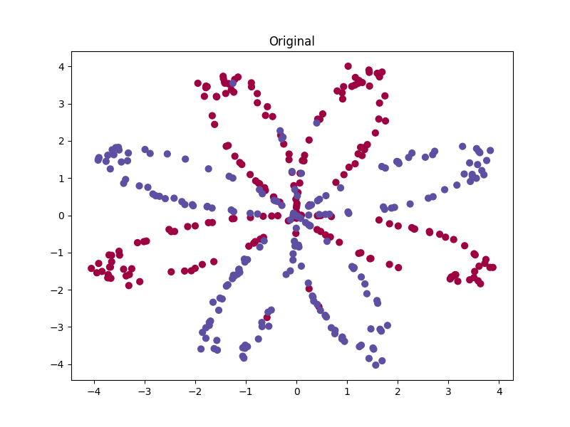
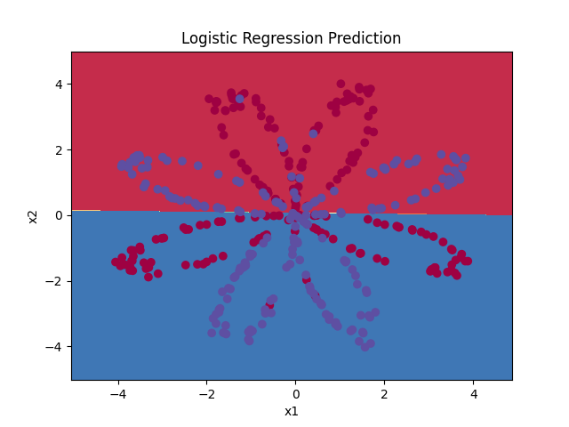
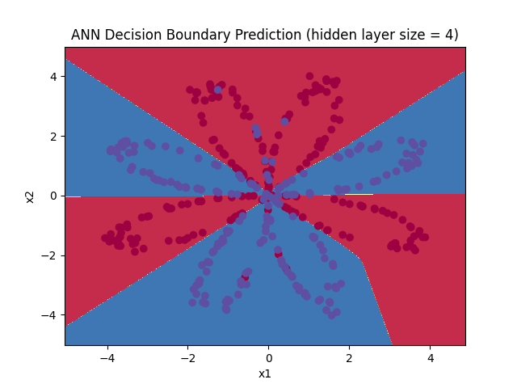

## Hidden Layer Size Analysis

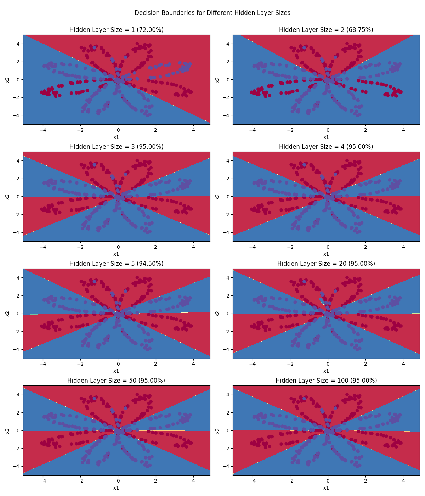

## Results from Console Output
```
Dataset:
The shape of X is: (2, 400)
The shape of Y is: (1, 400)
Training examples: 400

Logistic Regression Accuracy: 49.75% (percentage of correctly labelled datapoints)

Artificial Neural Network:
Cost after iteration 0: 0.693166
Cost after iteration 1000: 0.192328
Cost after iteration 2000: 0.180411
Cost after iteration 3000: 0.174681
Cost after iteration 4000: 0.170602
Cost after iteration 5000: 0.164591
Cost after iteration 6000: 0.160756
Cost after iteration 7000: 0.158575
Cost after iteration 8000: 0.156965
Cost after iteration 9000: 0.155674

ANN Accuracy: 95.00%

Testing different hidden layer sizes:
Accuracy for 1 hidden units: 72.00%
Accuracy for 2 hidden units: 68.75%
Accuracy for 3 hidden units: 95.00%
Accuracy for 4 hidden units: 95.00%
Accuracy for 5 hidden units: 94.50%
Accuracy for 20 hidden units: 95.00%
Accuracy for 50 hidden units: 95.00%
Accuracy for 100 hidden units: 95.00%
```

# Task 2

## Binary Classification on Different Datasets

### Noisy Circles
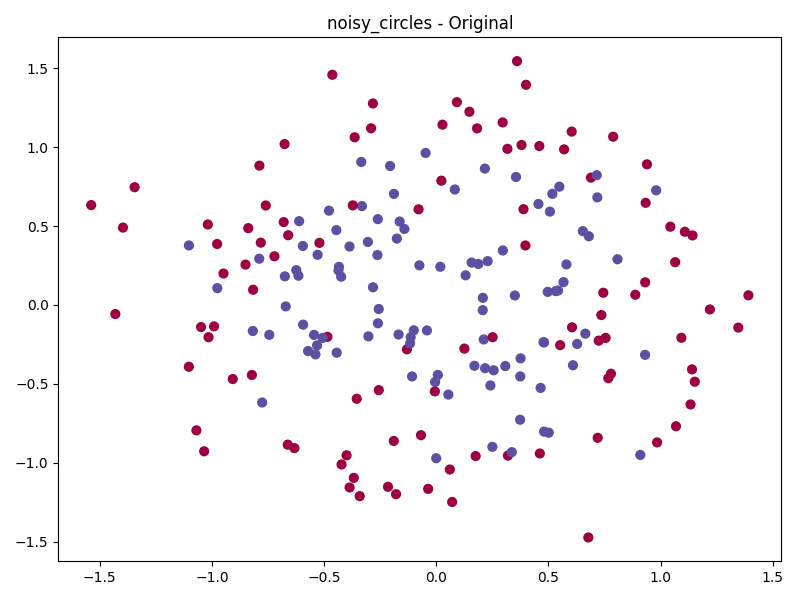
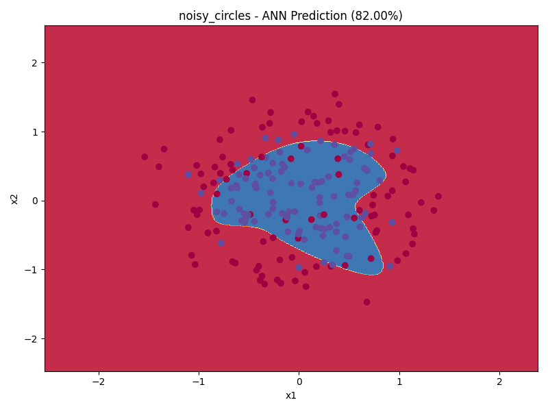

### Noisy Moons
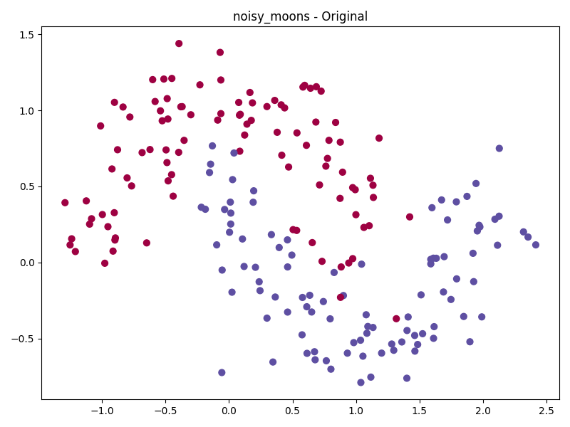
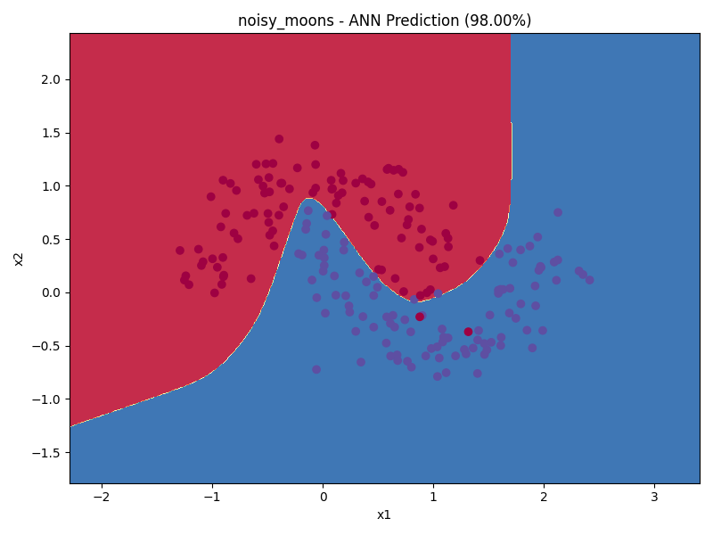

### Gaussian Quantiles
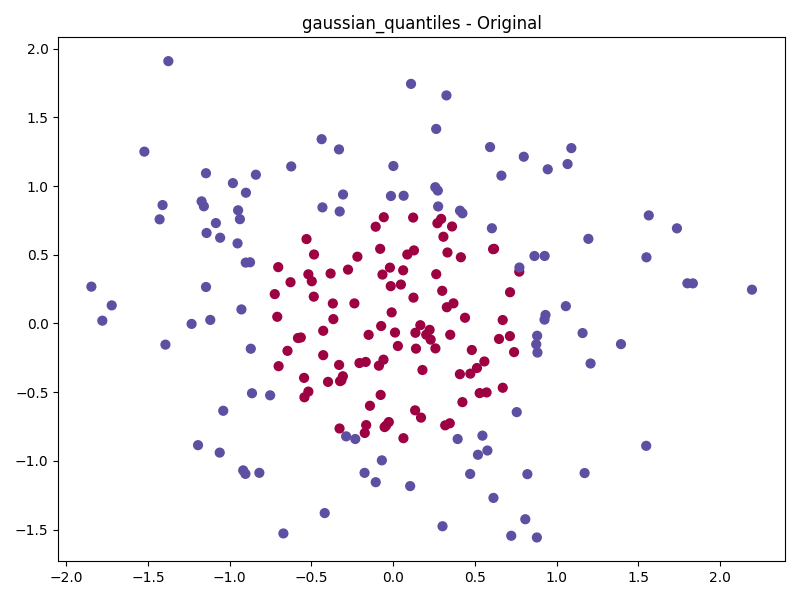
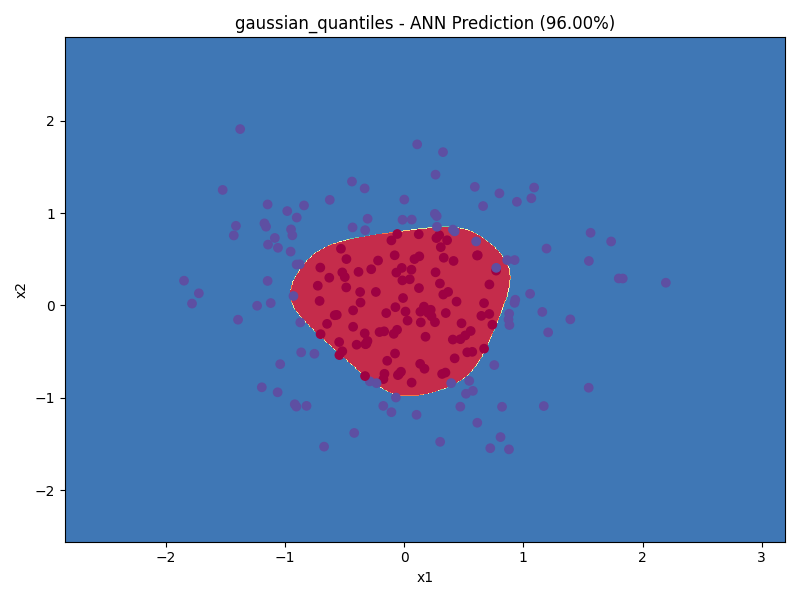

### Blobs (Multi-class)
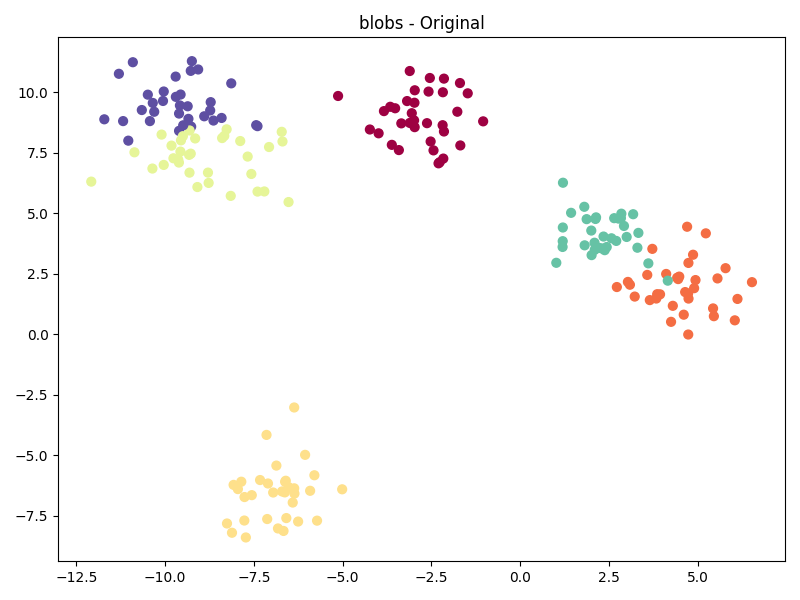

## Results from Console Output
```
Accuracy on noisy_circles: 82.00%
Accuracy on noisy_moons: 98.00%
Skip blobs (not suitable for binary classification)
Accuracy on gaussian_quantiles: 96.00%
```