# Task 1: MNIST and Fashion MNIST Data Visualization

## MNIST Dataset Visualization

### Batch of Samples
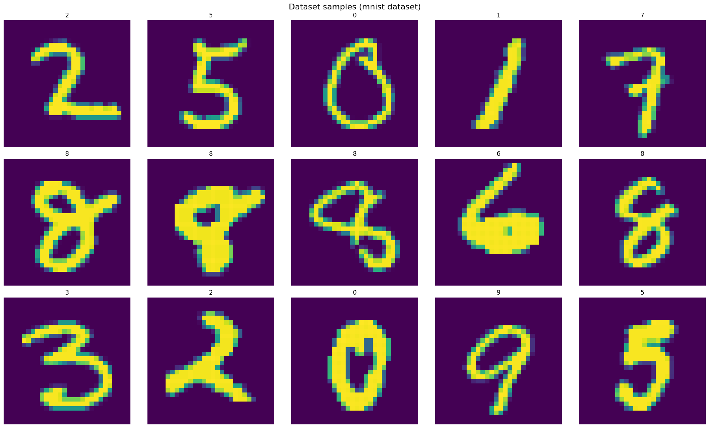

### Class Balance
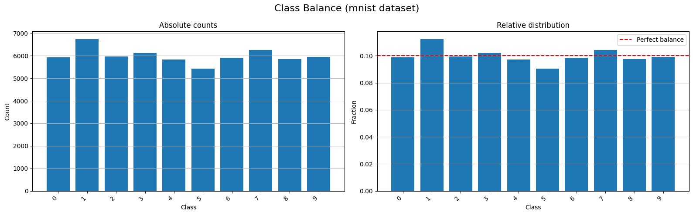

### Average Images per Class
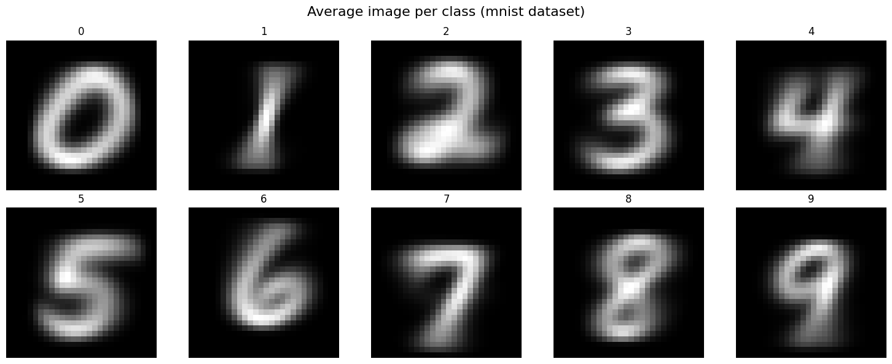

## Fashion MNIST Dataset Visualization

### Batch of Samples
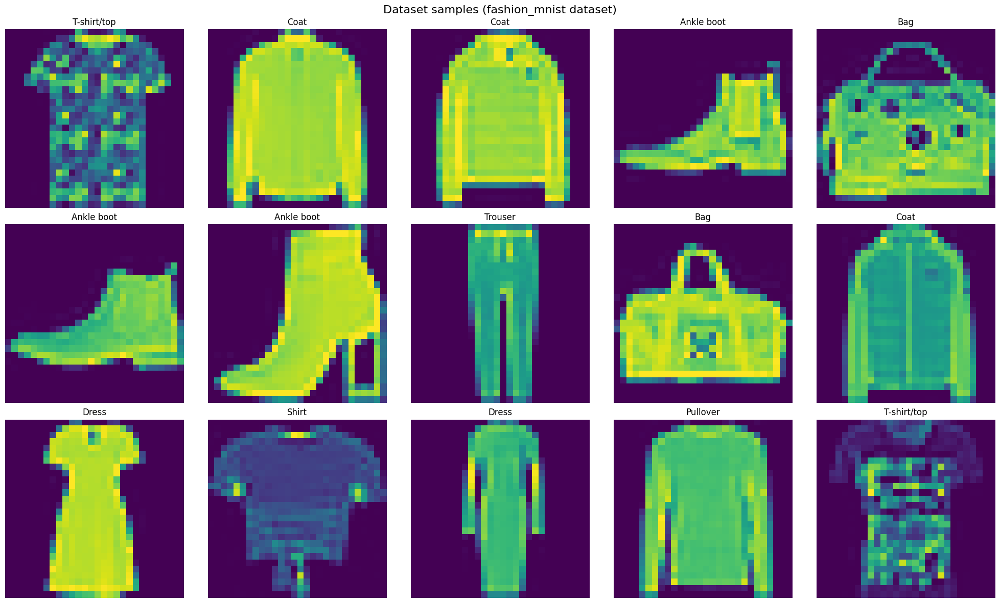

### Class Balance
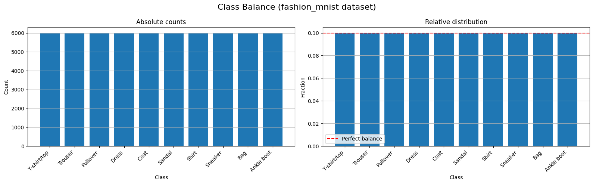

### Average Images per Class
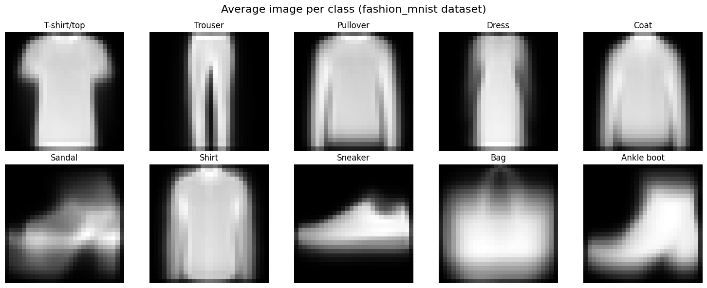

## Results from Console Output

```
MNIST:
Train: 60000 samples
Test:  10000 samples
Shape: (60000, 28, 28)

Fashion MNIST:
Train: 60000 samples
Test:  10000 samples
Shape: (60000, 28, 28)
```

# Task 2: CIFAR-10 Classification with Neural Networks

## CIFAR-10 Dataset Visualization

### Batch of Samples
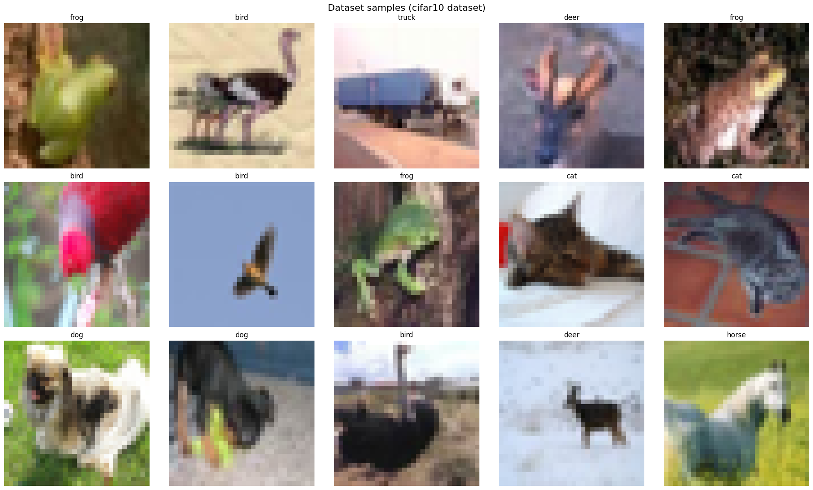

### Class Balance
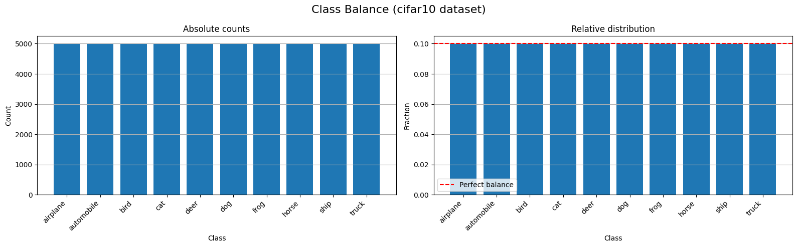

### Average Images per Class
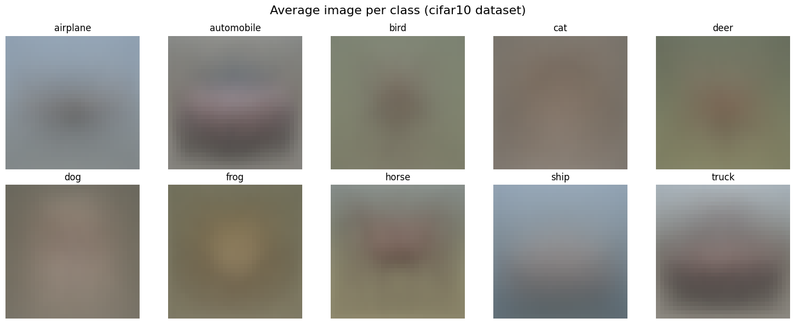

## Model Training History

### Training History
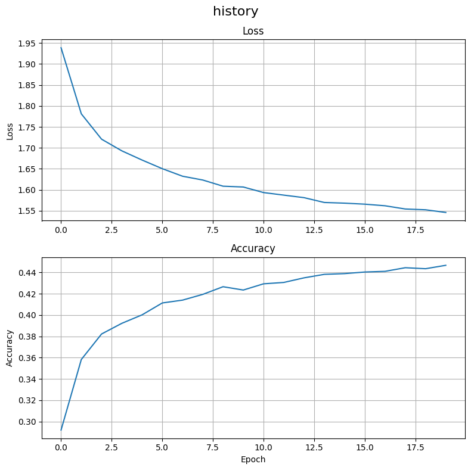

## Model Predictions

### Sample Predictions
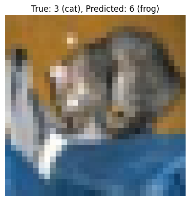

## Results from Console Output

```
CIFAR-10:
Train: 50000 samples
Test:  10000 samples
Shape: (50000, 32, 32, 3)

Model summary:
Model: "sequential"
┏━━━━━━━━━━━━━━━━━━━━━━━━━━━━━━━━━┳━━━━━━━━━━━━━━━━━━━━━━━━┳━━━━━━━━━━━━━━━┓
┃ Layer (type)                    ┃ Output Shape           ┃       Param # ┃
┡━━━━━━━━━━━━━━━━━━━━━━━━━━━━━━━━━╇━━━━━━━━━━━━━━━━━━━━━━━━╇━━━━━━━━━━━━━━━┩
│ flatten (Flatten)               │ (None, 3072)           │             0 │
├─────────────────────────────────┼────────────────────────┼───────────────┤
│ dense (Dense)                   │ (None, 16)             │        49,168 │
├─────────────────────────────────┼────────────────────────┼───────────────┤
│ dense_1 (Dense)                 │ (None, 32)             │           544 │
├─────────────────────────────────┼────────────────────────┼───────────────┤
│ dense_2 (Dense)                 │ (None, 32)             │         1,056 │
├─────────────────────────────────┼────────────────────────┼───────────────┤
│ dense_3 (Dense)                 │ (None, 10)             │           330 │
└─────────────────────────────────┴────────────────────────┴───────────────┘
 Total params: 51,098 (199.60 KB)
 Trainable params: 51,098 (199.60 KB)
 Non-trainable params: 0 (0.00 B)

Model fitting:
Epoch 1/20
391/391 ━━━━━━━━━━━━━━━━━━━━ 1s 1ms/step - accuracy: 0.2920 - loss: 1.9387
Epoch 2/20
391/391 ━━━━━━━━━━━━━━━━━━━━ 1s 1ms/step - accuracy: 0.3583 - loss: 1.7811
Epoch 3/20
391/391 ━━━━━━━━━━━━━━━━━━━━ 1s 2ms/step - accuracy: 0.3822 - loss: 1.7207
Epoch 4/20
391/391 ━━━━━━━━━━━━━━━━━━━━ 1s 1ms/step - accuracy: 0.3922 - loss: 1.6929
Epoch 5/20
391/391 ━━━━━━━━━━━━━━━━━━━━ 1s 1ms/step - accuracy: 0.4002 - loss: 1.6710
Epoch 6/20
391/391 ━━━━━━━━━━━━━━━━━━━━ 1s 1ms/step - accuracy: 0.4114 - loss: 1.6504
Epoch 7/20
391/391 ━━━━━━━━━━━━━━━━━━━━ 1s 1ms/step - accuracy: 0.4141 - loss: 1.6324
Epoch 8/20
391/391 ━━━━━━━━━━━━━━━━━━━━ 1s 2ms/step - accuracy: 0.4195 - loss: 1.6233
Epoch 9/20
391/391 ━━━━━━━━━━━━━━━━━━━━ 1s 1ms/step - accuracy: 0.4267 - loss: 1.6086
Epoch 10/20
391/391 ━━━━━━━━━━━━━━━━━━━━ 1s 1ms/step - accuracy: 0.4235 - loss: 1.6067
Epoch 11/20
391/391 ━━━━━━━━━━━━━━━━━━━━ 1s 1ms/step - accuracy: 0.4294 - loss: 1.5934
Epoch 12/20
391/391 ━━━━━━━━━━━━━━━━━━━━ 1s 2ms/step - accuracy: 0.4307 - loss: 1.5873
Epoch 13/20
391/391 ━━━━━━━━━━━━━━━━━━━━ 1s 1ms/step - accuracy: 0.4350 - loss: 1.5813
Epoch 14/20
391/391 ━━━━━━━━━━━━━━━━━━━━ 1s 2ms/step - accuracy: 0.4383 - loss: 1.5698
Epoch 15/20
391/391 ━━━━━━━━━━━━━━━━━━━━ 1s 1ms/step - accuracy: 0.4390 - loss: 1.5682
Epoch 16/20
391/391 ━━━━━━━━━━━━━━━━━━━━ 1s 1ms/step - accuracy: 0.4405 - loss: 1.5658
Epoch 17/20
391/391 ━━━━━━━━━━━━━━━━━━━━ 1s 2ms/step - accuracy: 0.4411 - loss: 1.5619
Epoch 18/20
391/391 ━━━━━━━━━━━━━━━━━━━━ 1s 1ms/step - accuracy: 0.4445 - loss: 1.5542
Epoch 19/20
391/391 ━━━━━━━━━━━━━━━━━━━━ 1s 1ms/step - accuracy: 0.4436 - loss: 1.5524
Epoch 20/20
391/391 ━━━━━━━━━━━━━━━━━━━━ 1s 2ms/step - accuracy: 0.4468 - loss: 1.5460

Model evaluation:
Test loss: 1.5779
Test accuracy: 0.4392

Sample prediction:
True label: 8 (ship)
Predicted label: 9 (truck)

First wrong prediction (index=0):
True label: 3 (cat)
Predicted label: 6 (frog)
```
