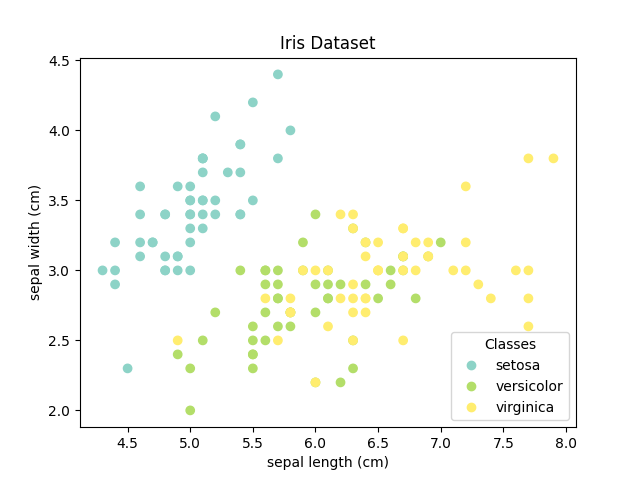
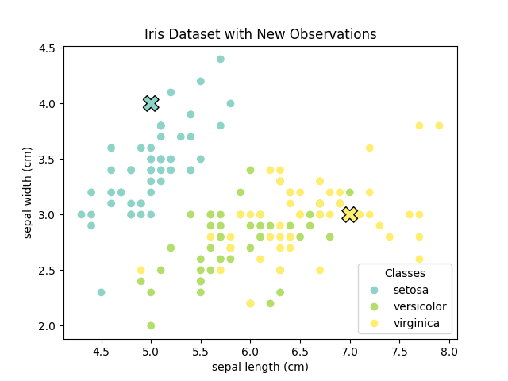

# Task 1: KNN Classification on Iris Dataset

## Iris Dataset Visualization

### Scatter Plot


### Scatter Plot with New Points


## Results from Console Output

```
Distances: [[5.27432715 5.55056374 5.84422608 5.86735655 6.10427699]]
Indices: [[41 60 93 57  8]]

Standardized feature values of the 5 nearest neighbors:
[[[-1.62768839 -1.74335684 -1.39706395 -1.18381211]
  [-1.02184904 -2.43394714 -0.14664056 -0.26238682]
  [-1.02184904 -1.74335684 -0.26031542 -0.26238682]
  [-1.14301691 -1.51316008 -0.26031542 -0.26238682]
  [-1.74885626 -0.36217625 -1.34022653 -1.3154443 ]]]

New observations:
[5, 4, 2, 1] -> setosa
[7, 3, 3, 4] -> virginica

Best k: 6

Accuracy with k=5: 95.33%
Accuracy with k=6: 96.67%
```

# Task 2: Custom KNN Implementation with Distance Metrics Comparison

## Results from Console Output

```
KNN with L2 distance:
Accuracy = 97.78%

Classification Report:
              precision    recall  f1-score   support

      setosa       1.00      1.00      1.00        19
  versicolor       1.00      0.92      0.96        13
   virginica       0.93      1.00      0.96        13

    accuracy                           0.98        45
   macro avg       0.98      0.97      0.97        45
weighted avg       0.98      0.98      0.98        45

KNN with L1 distance:
Accuracy = 100.00%

Classification Report:
              precision    recall  f1-score   support

      setosa       1.00      1.00      1.00        19
  versicolor       1.00      1.00      1.00        13
   virginica       1.00      1.00      1.00        13

    accuracy                           1.00        45
   macro avg       1.00      1.00      1.00        45
weighted avg       1.00      1.00      1.00        45

Comparison:
L2 Accuracy: 97.78%
L1 Accuracy: 100.00%
```