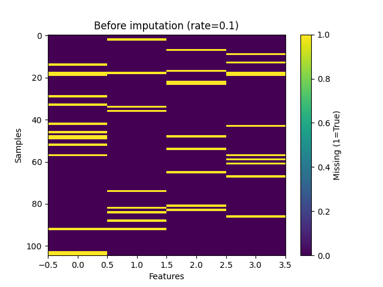
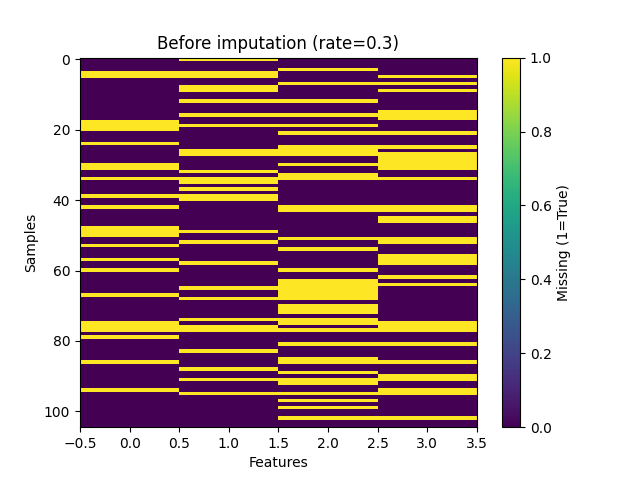
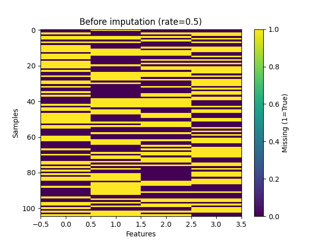
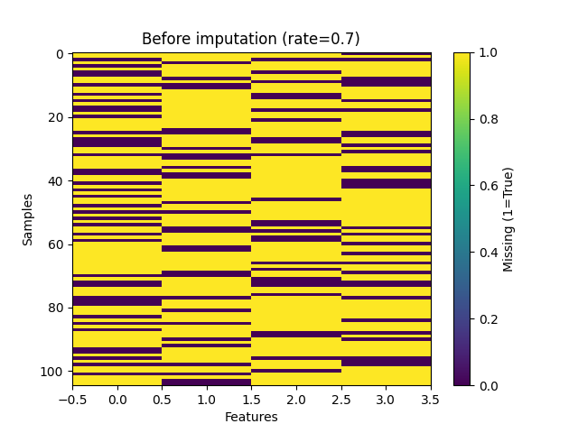
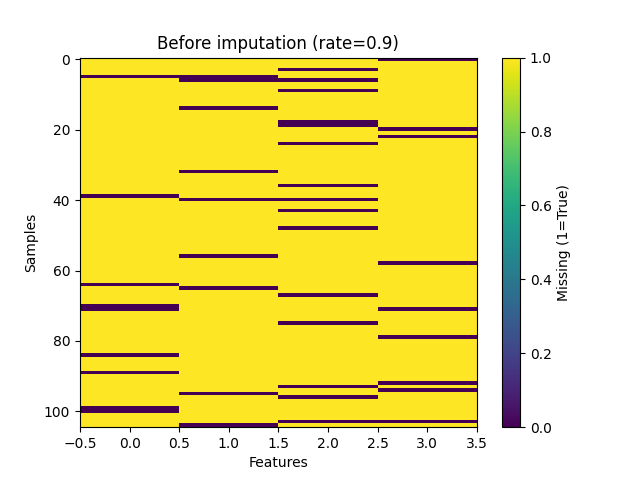

# KNN Imputation with Missing Values on Iris Dataset

## Missing Data Visualization

### Missing Rate: 0.1 (10%)


### Missing Rate: 0.3 (30%)


### Missing Rate: 0.5 (50%)


### Missing Rate: 0.7 (70%)


### Missing Rate: 0.9 (90%)


## Results from Console Output

```
Missing rate: 0.1:
L2 accuracy: 97.78%
L1 accuracy: 100.00%

Missing rate: 0.3:
L2 accuracy: 93.33%
L1 accuracy: 91.11%

Missing rate: 0.5:
L2 accuracy: 84.44%
L1 accuracy: 88.89%

Missing rate: 0.7:
L2 accuracy: 88.89%
L1 accuracy: 86.67%

Missing rate: 0.9:
L2 accuracy: 93.33%
L1 accuracy: 93.33%
```
