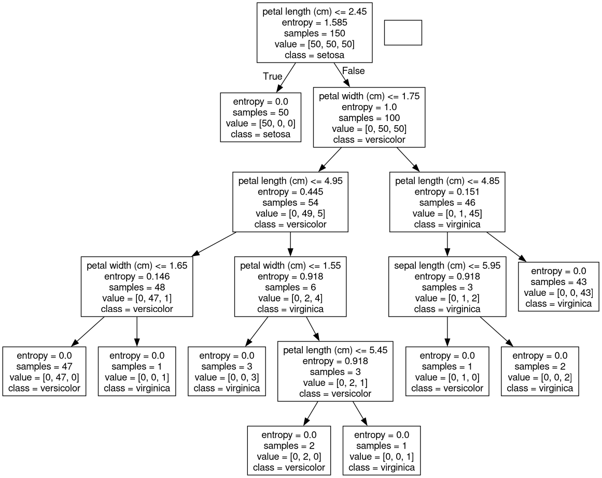
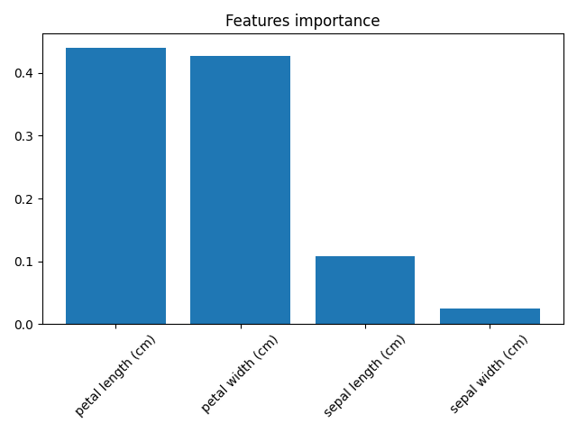
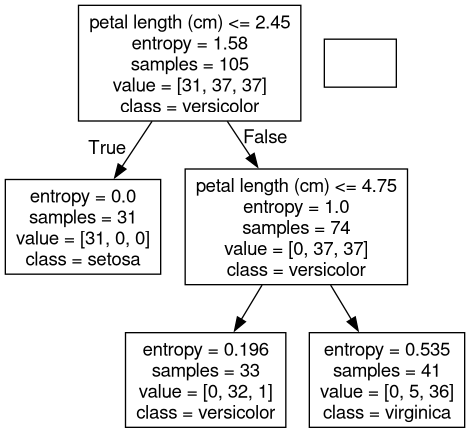
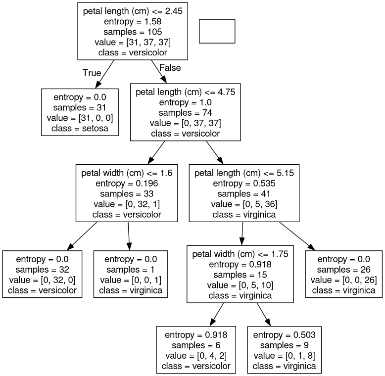
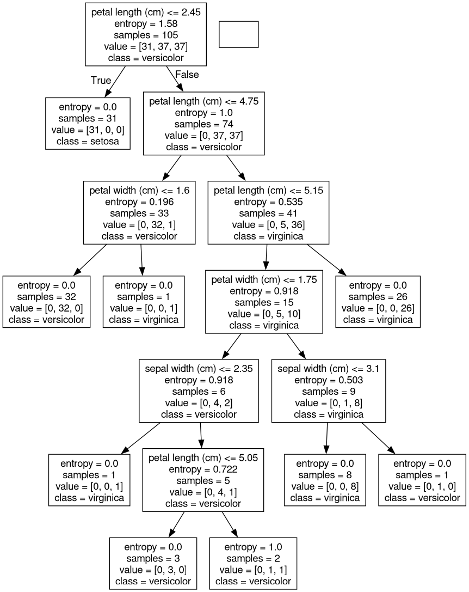
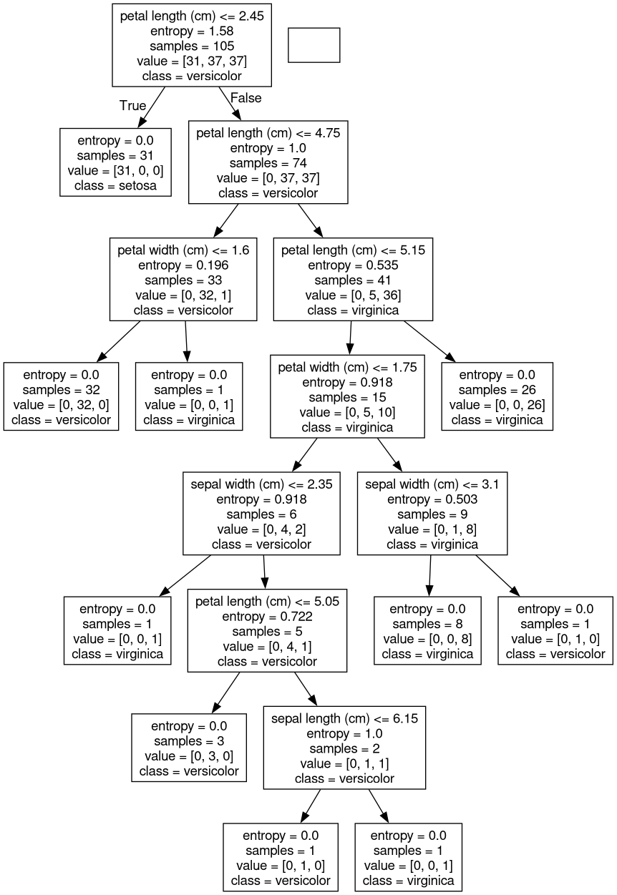
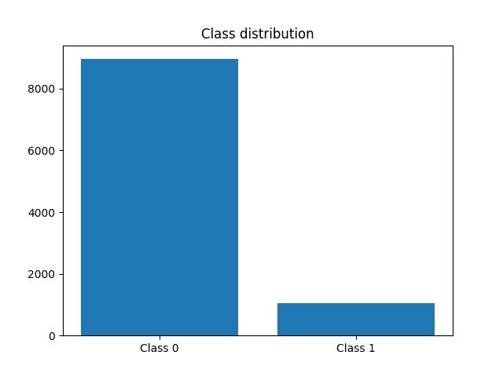

# Task 1: Decision Tree Classification on Iris Dataset

## Decision Tree Visualization

### Decision Tree Structure


## Results from Console Output

```
Predictions:
[1 0]

Prediction probabilities:
[[0. 1. 0.]
 [1. 0. 0.]]
```

# Task 2: Random Forest Classification with Feature Importance

## Feature Importance Analysis

### Feature Importance Bar Chart


## Results from Console Output

```
Predictions (all features):
[1 0]

Prediction probabilities (all features):
[[0.02439024 0.54471545 0.43089431]
 [0.49593496 0.21138211 0.29268293]]

Predictions (selected features only):
[2 1]

Prediction probabilities (selected features only):
[[0.         0.01626016 0.98373984]
 [0.49593496 0.50406504 0.        ]]
```

# Task 3: Decision Tree with Different Max Depth Values

## Decision Tree Structures at Different Depths

### Max Depth = 2


### Max Depth = 4


### Max Depth = 6


### Max Depth = 8


## Results from Console Output

```
max_depth=2: 97.78%
max_depth=4: 100.00%
max_depth=6: 97.78%
max_depth=8: 97.78%
```

# Task 4: Random Forest Classification on Imbalanced Dataset

## Class Distribution

### Class Distribution Bar Chart


## Results from Console Output

```
Random Forest Classifier without weights:
              precision    recall  f1-score   support

           0       0.96      0.98      0.97      2687
           1       0.79      0.69      0.74       313

    accuracy                           0.95      3000
   macro avg       0.88      0.84      0.85      3000
weighted avg       0.95      0.95      0.95      3000

[[2629   58]
 [  96  217]]

Random Forest Classifier with weights:
              precision    recall  f1-score   support

           0       0.96      0.98      0.97      2687
           1       0.80      0.66      0.72       313

    accuracy                           0.95      3000
   macro avg       0.88      0.82      0.85      3000
weighted avg       0.94      0.95      0.95      3000

[[2635   52]
 [ 106  207]]
```
