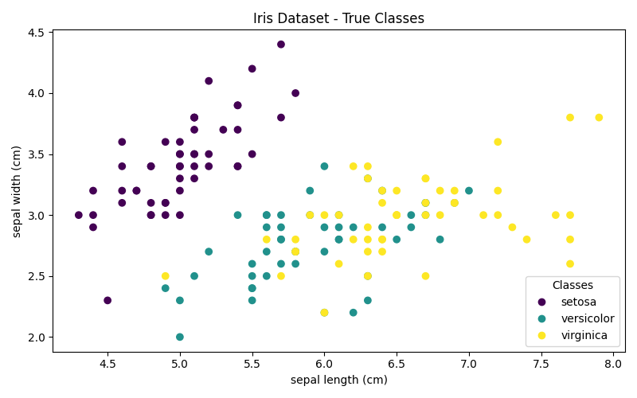
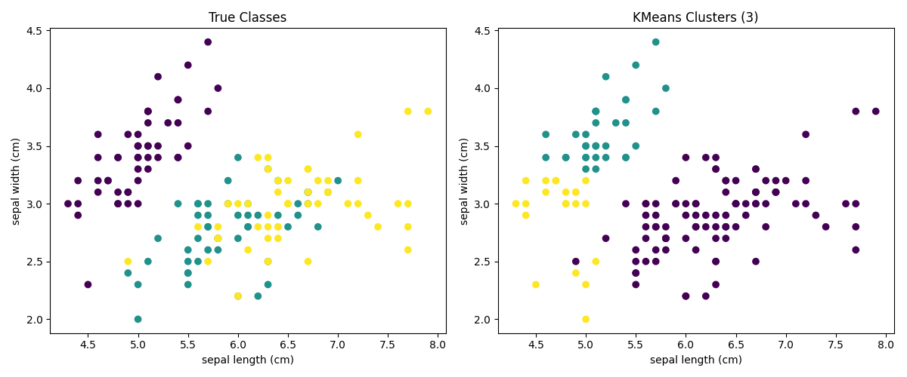
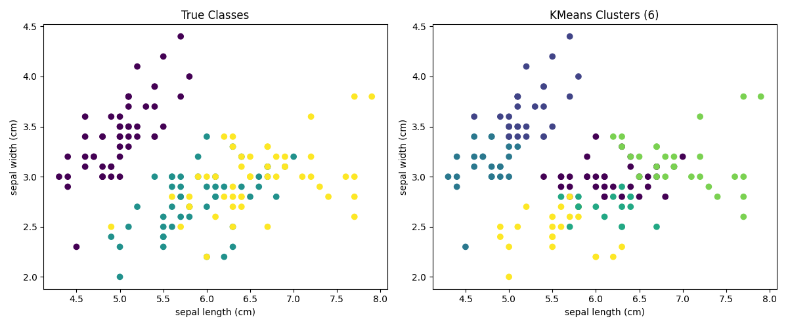
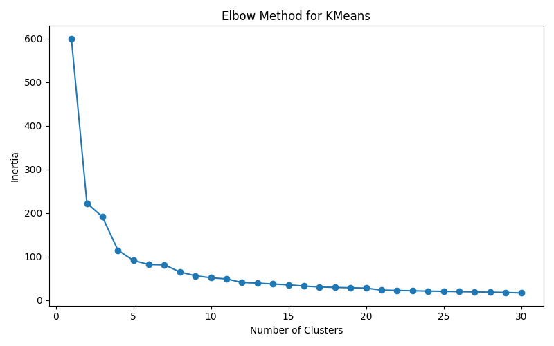
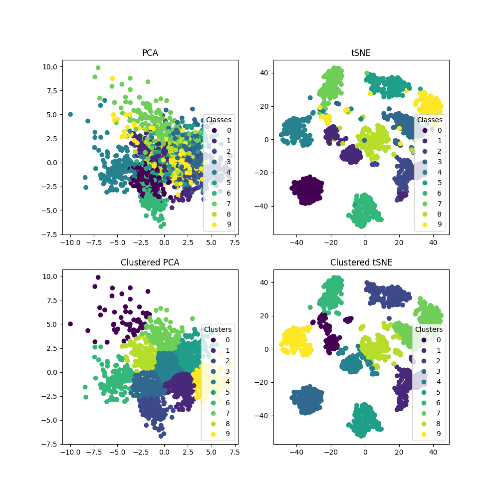
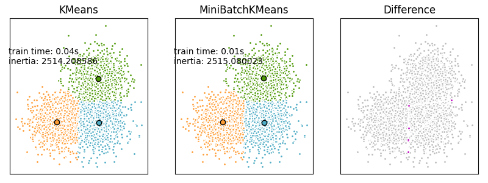
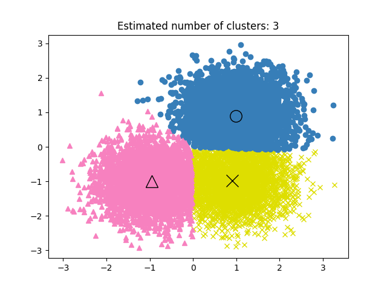
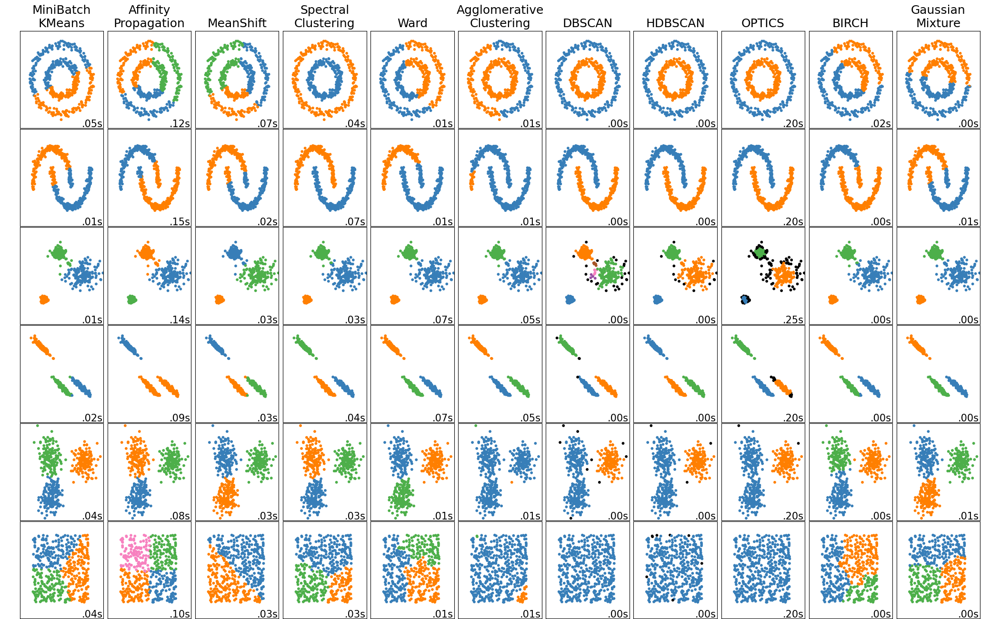

# Task 1: KMeans Clustering on Iris Dataset

## Iris Dataset Visualization

### True Classes


### KMeans Clustering (3 clusters)


### KMeans Clustering (6 clusters)


### Elbow Method 


## Results from Console Output

```
Predicted clusters for 3 clusters:
[1 2 2 2 1 1 1 1 2 2 1 1 2 2 1 1 1 1 1 1 1 1 1 1 1 2 1 1 1 2 2 1 1 1 2 2 1
 1 2 1 1 2 2 1 1 2 1 2 1 1 0 0 0 0 0 0 0 2 0 0 2 0 0 0 0 0 0 0 0 0 0 0 0 0
 0 0 0 0 0 0 0 0 0 0 0 0 0 0 0 0 0 0 0 2 0 0 0 0 2 0 0 0 0 0 0 0 0 0 0 0 0
 0 0 0 0 0 0 0 0 0 0 0 0 0 0 0 0 0 0 0 0 0 0 0 0 0 0 0 0 0 0 0 0 0 0 0 0 0
 0 0]

Predicted clusters for 6 clusters:
[1 2 2 2 1 1 2 1 2 2 1 2 2 2 1 1 1 1 1 1 1 1 1 2 2 2 1 1 1 2 2 1 1 1 2 2 1
 1 2 1 1 2 2 1 1 2 1 2 1 2 0 0 0 5 0 0 0 5 0 5 5 0 5 0 0 0 0 5 5 5 0 0 3 0
 0 0 0 0 0 5 5 5 5 3 0 0 0 5 0 5 5 0 5 5 5 0 0 0 5 5 4 3 4 3 4 4 5 4 3 4 4
 3 4 3 3 4 0 4 4 5 4 3 4 3 4 4 3 0 3 4 4 4 3 0 3 4 4 0 0 4 4 4 3 4 4 4 3 4
 4 0]
```

---

# Task 2: PCA vs t-SNE Dimensionality Reduction with KMeans

### Comparison of Projection Methods



---

# Task 3: KMeans vs MiniBatchKMeans Comparison

### Performance Comparison on Synthetic Dataset



---

# Task 4: MeanShift Clustering

### MeanShift Clustering Results



## Results from Console Output

```
number of estimated clusters : 3
```

---

# Task 5: Comprehensive Clustering Algorithms Comparison

### Comparison of 11 Different Clustering Algorithms


