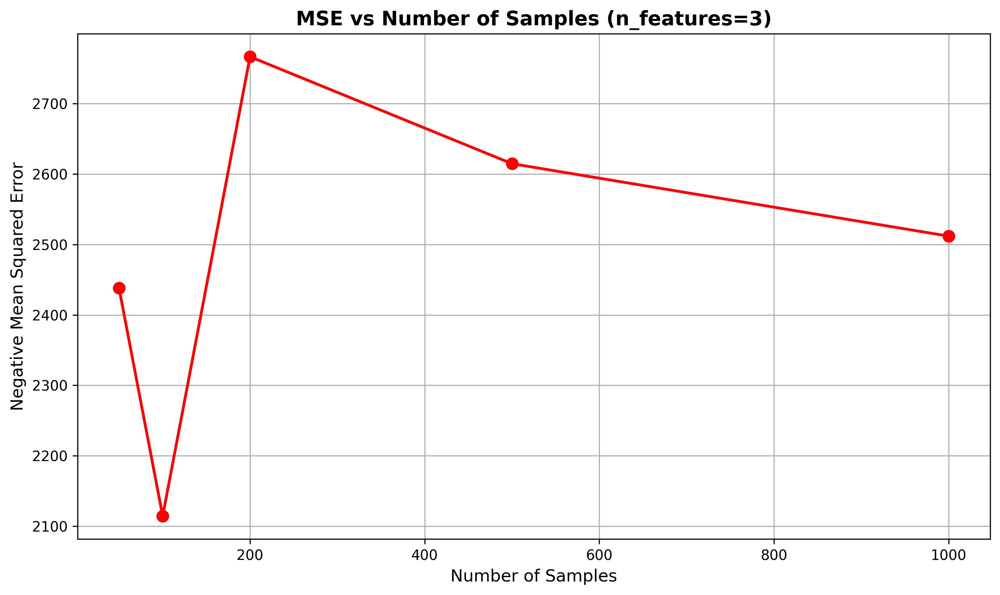
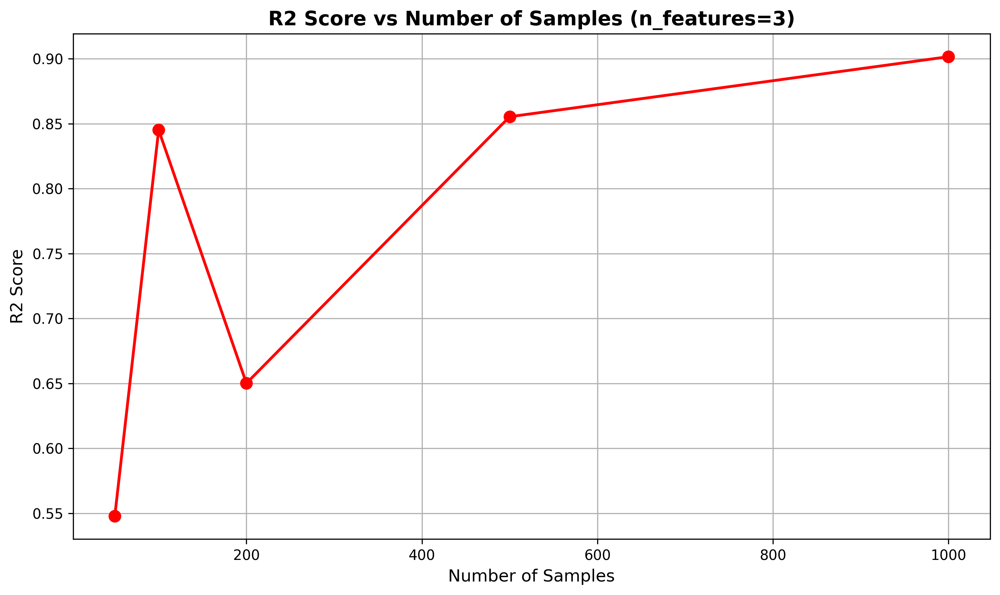
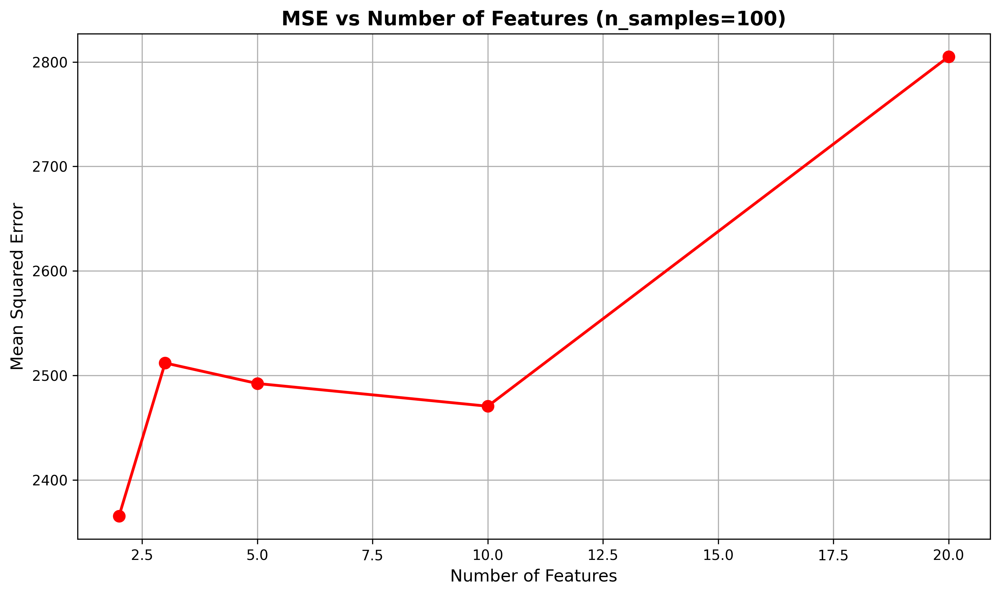
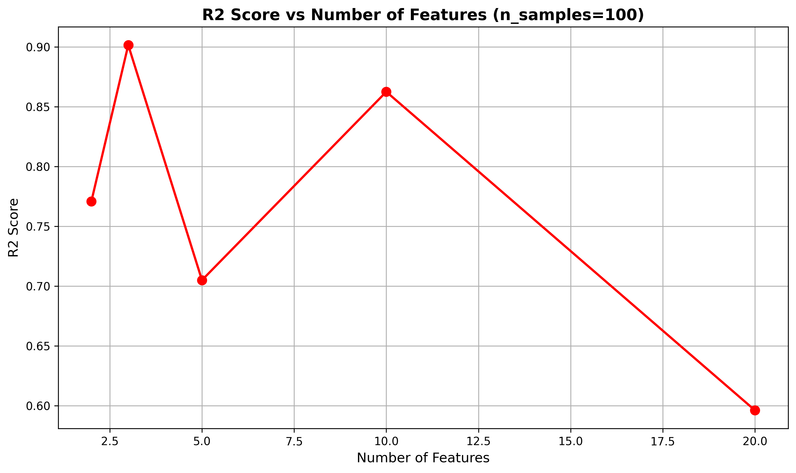
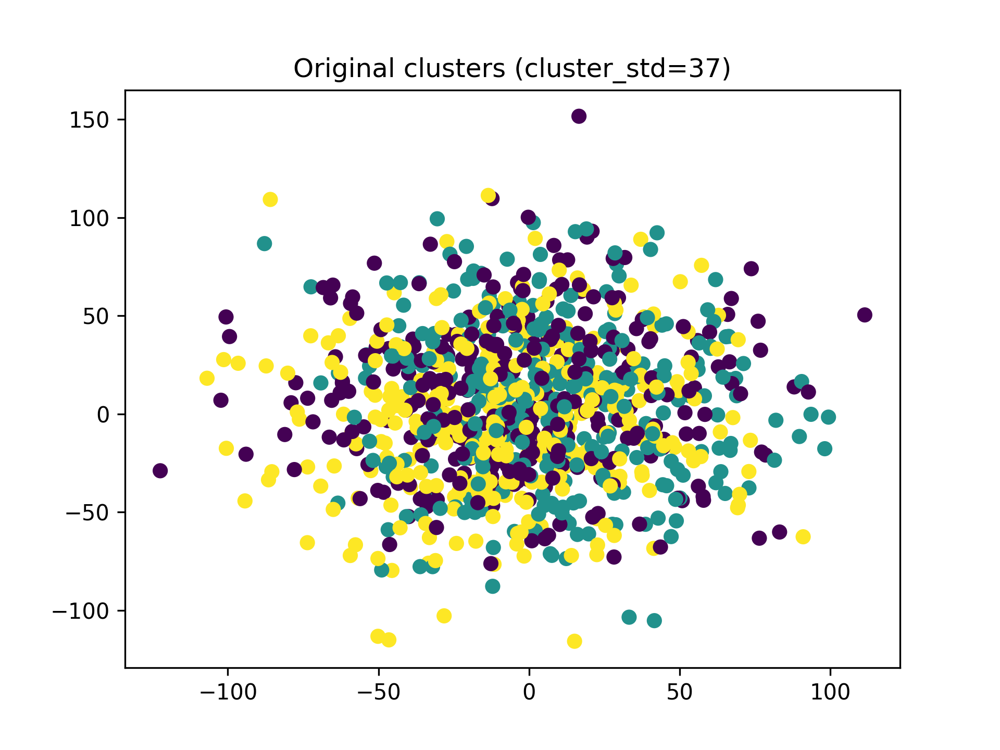
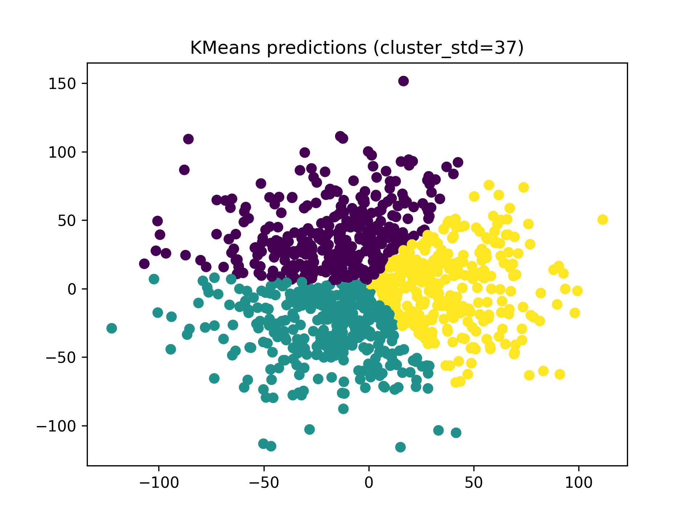
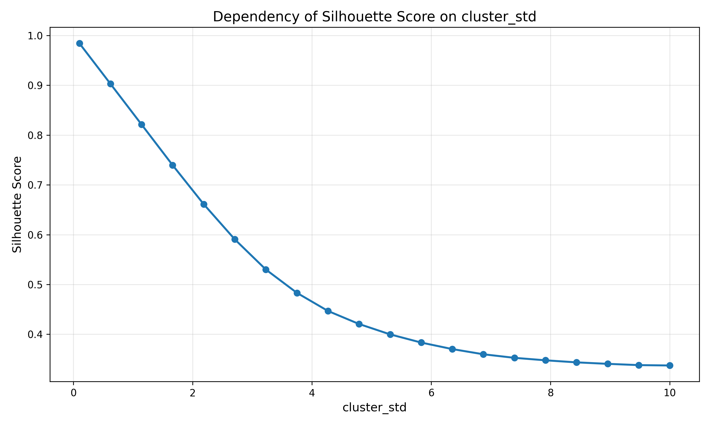
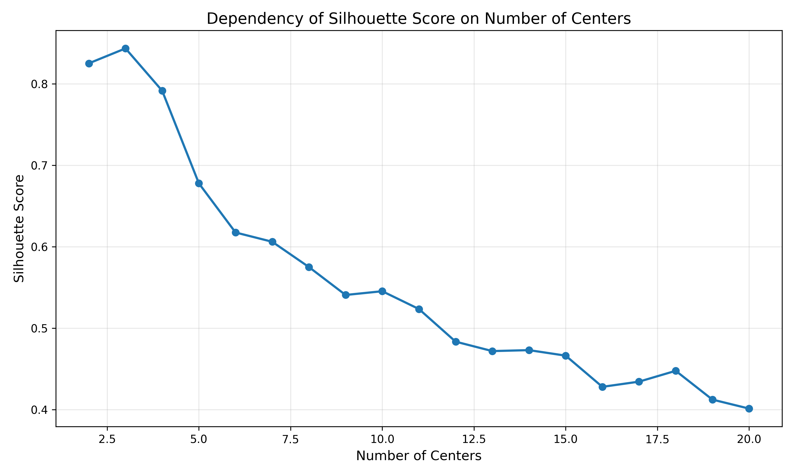
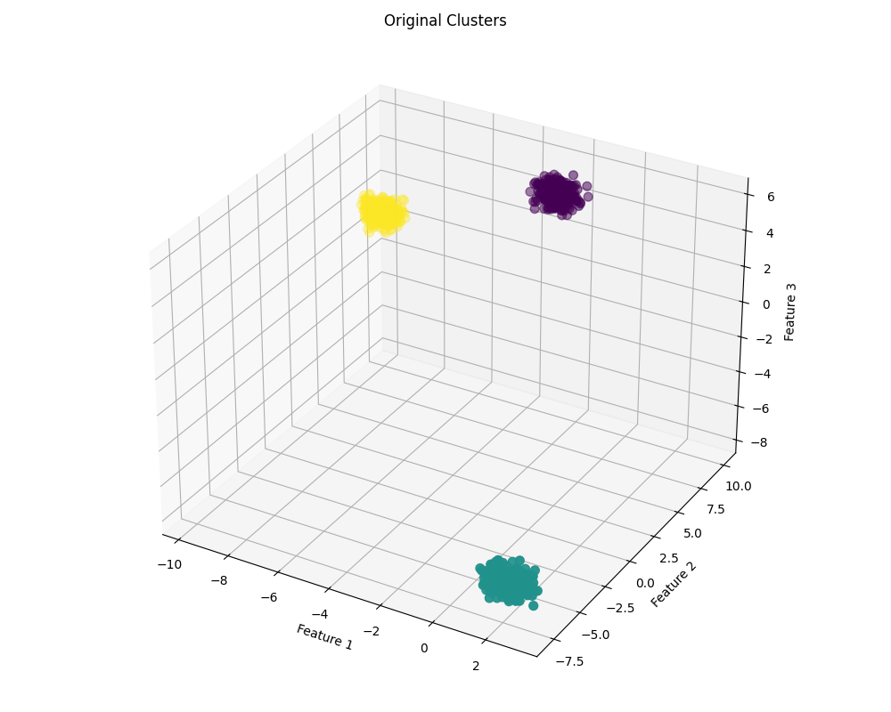
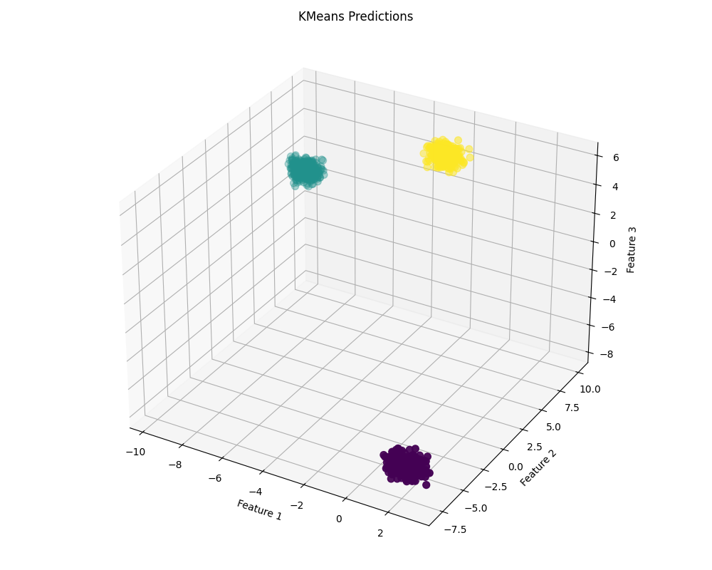

# Task 1

## Середньоквадратична помилка (MSE) VS Кількість зразків (n_samples)



## R2 VS Кількість зразків (n_samples)



## Середньоквадратична помилка (MSE) VS Кількість ознак (n_features)



## R2 VS Кількість ознак (n_features)



## Результати з консольного виводу

```
Comparison of different n_samples (with n_features=3):
n_samples=50: MSE=2438.22, R2=0.5478
n_samples=100: MSE=2114.34, R2=0.8452
n_samples=200: MSE=2766.62, R2=0.6501
n_samples=500: MSE=2614.70, R2=0.8553
n_samples=1000: MSE=2511.84, R2=0.9016

Comparison of different n_features (with n_samples=1000):
n_features=2: MSE=2365.28, R2=0.7709
n_features=3: MSE=2511.84, R2=0.9016
n_features=5: MSE=2492.21, R2=0.7049
n_features=10: MSE=2470.46, R2=0.8625
n_features=20: MSE=2805.01, R2=0.5961
```

# Task 2

## Оригінальні кластери (Original Clusters) з cluster_std=37



## KMeans Predictions з cluster_std=37



## Силуетний коефіцієнт (Silhouette Score) VS cluster_std



## Силуетний коефіцієнт (Silhouette Score) VS Кількість центрів (centers)



## Результати з консольного виводу

```
Testing single cluster_std value:
Cluster_std: 37, Silhouette Score: 0.33

Comparing different cluster_std values:
cluster_std=0.10, silhouette_score=0.98
cluster_std=0.62, silhouette_score=0.90
cluster_std=1.14, silhouette_score=0.82
cluster_std=1.66, silhouette_score=0.74
cluster_std=2.18, silhouette_score=0.66
cluster_std=2.71, silhouette_score=0.59
cluster_std=3.23, silhouette_score=0.53
cluster_std=3.75, silhouette_score=0.48
cluster_std=4.27, silhouette_score=0.45
cluster_std=4.79, silhouette_score=0.42
cluster_std=5.31, silhouette_score=0.40
cluster_std=5.83, silhouette_score=0.38
cluster_std=6.35, silhouette_score=0.37
cluster_std=6.87, silhouette_score=0.36
cluster_std=7.39, silhouette_score=0.35
cluster_std=7.92, silhouette_score=0.35
cluster_std=8.44, silhouette_score=0.34
cluster_std=8.96, silhouette_score=0.34
cluster_std=9.48, silhouette_score=0.34
cluster_std=10.00, silhouette_score=0.34

Comparing different numbers of centers:
centers=2, silhouette_score=0.83
centers=3, silhouette_score=0.84
centers=4, silhouette_score=0.79
centers=5, silhouette_score=0.68
centers=6, silhouette_score=0.62
centers=7, silhouette_score=0.61
centers=8, silhouette_score=0.58
centers=9, silhouette_score=0.54
centers=10, silhouette_score=0.55
centers=11, silhouette_score=0.52
centers=12, silhouette_score=0.48
centers=13, silhouette_score=0.47
centers=14, silhouette_score=0.47
centers=15, silhouette_score=0.47
centers=16, silhouette_score=0.43
centers=17, silhouette_score=0.43
centers=18, silhouette_score=0.45
centers=19, silhouette_score=0.41
centers=20, silhouette_score=0.40
```

# Task 3

## Оригінальні кластери (Original Clusters)



## KMeans Predictions



## Результати з консольного виводу

```
Silhouette Score: 0.91
```
