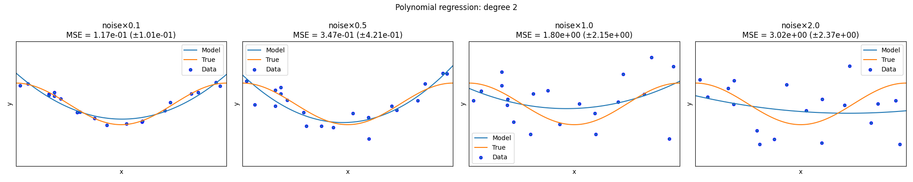
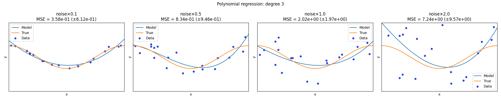
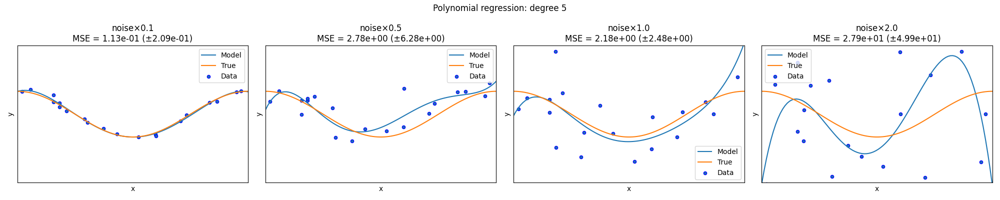
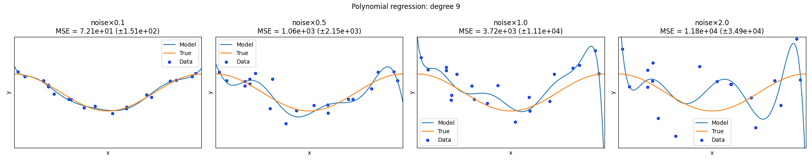
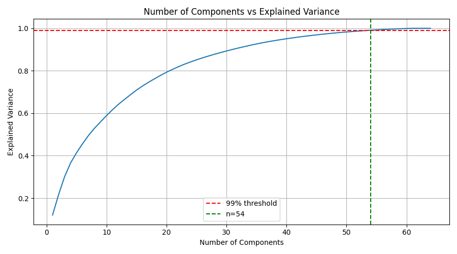
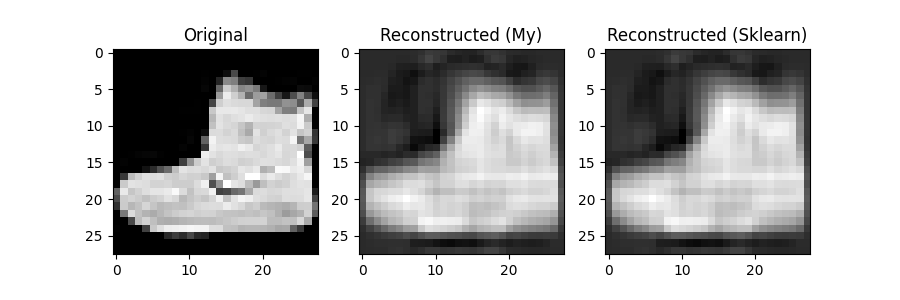

# Task 1

## Polynomial Regression: Noise vs Degree






## Результати з консольного виводу

```
Results:
  #  Degree  Noise      Mean MSE       Std MSE
  1       5    0.1        0.1129        0.2093
  2       2    0.1        0.1169        0.1006
  3       2    0.5        0.3474        0.4212
  4       3    0.1        0.3584        0.6124
  5       3    0.5        0.8339        0.9464
  6       2    1.0        1.8047        2.1536
  7       3    1.0        2.0237        1.9720
  8       5    1.0        2.1840        2.4810
  9       5    0.5        2.7769        6.2799
 10       2    2.0        3.0231        2.3695
 11       3    2.0        7.2366        9.5680
 12       5    2.0       27.8883       49.9380
 13       9    0.1       72.0739      150.7787
 14       9    0.5     1056.9459     2148.7227
 15       9    1.0     3723.7727    11095.7188
 16       9    2.0    11802.7661    34911.8790
```

# Task 2

## Number of Components VS Explained Variance



## Результати з консольного виводу

```
Dataset shape: (1797, 64)

Explained variance ratio of the first 5 components:
[0.12033916 0.09561054 0.08444415 0.06498408 0.04860155]

Cumulative explained variance of the first 5 components:
[0.12033916 0.21594971 0.30039385 0.36537793 0.41397948]

Components needed for >= 99% explained variance: 54
```

# Task 3

## Reconstruction Comparison (My PCA vs Sklearn PCA)



## Результати з консольного виводу

```
My PCA MSE: 776.87115
Sklearn PCA MSE: 776.87115

My PCA explained variance ratio (first 5):
[0.29039228 0.1775531  0.06019222 0.04957428 0.03847655]

Sklearn PCA explained variance ratio (first 5):
[0.29039225 0.17755307 0.06019221 0.04957427 0.03847654]
```
