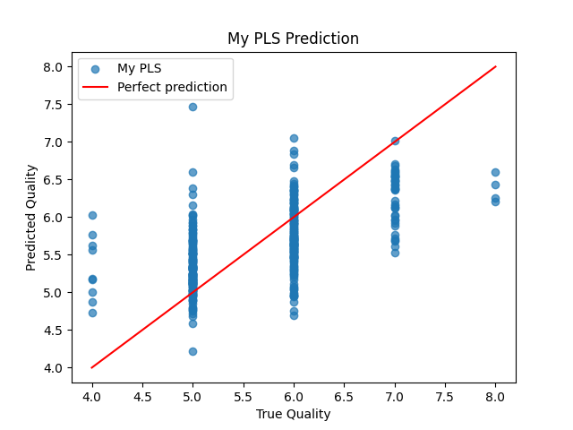
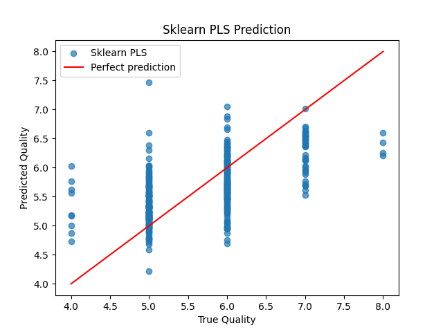

## PLS Prediction Comparison

### My PLS Implementation



### Sklearn PLS



## Результати з консольного виводу

```
My PLS MSE: 0.3878403902053833
Sklearn PLS MSE: 0.3878390826745509

My PLS R2: 0.33294785022735596
Sklearn PLS R2: 0.33295011640286765

My PLS coefficients:
[ 0.09353764 -0.26796344 -0.050482    0.00523588 -0.11971439  0.05463778
 -0.13166687 -0.08145311 -0.05158685  0.2085859   0.3342123  -0.04923125]

Sklearn PLS coefficients:
[ 4.56550602e-02 -1.24113075e+00 -2.15751376e-01  3.33095103e-03
 -2.12625081e+00  4.40628490e-03 -3.50956276e-03 -3.55545760e+01
 -2.80782496e-01  1.02082368e+00  2.57959526e-01 -8.66667987e-05]
```