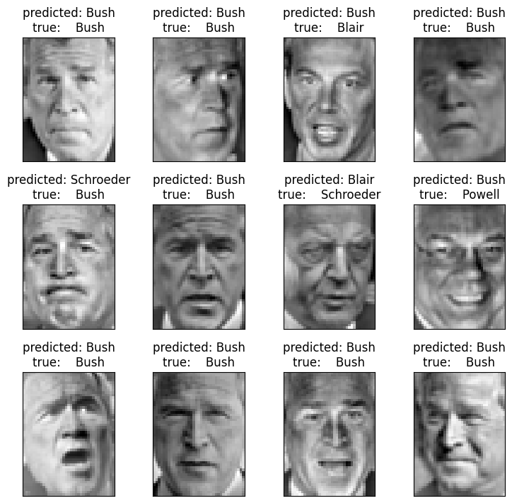
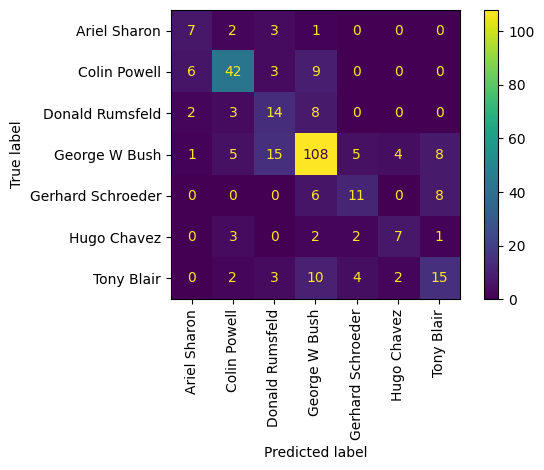
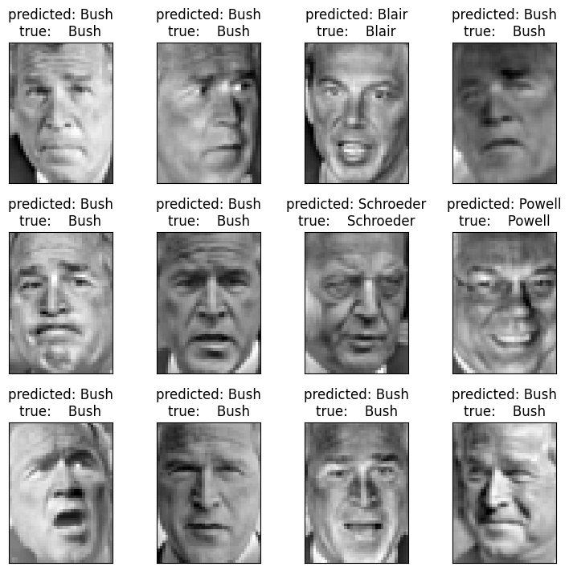
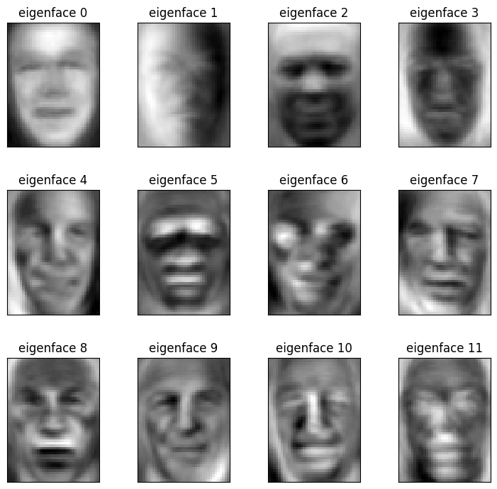
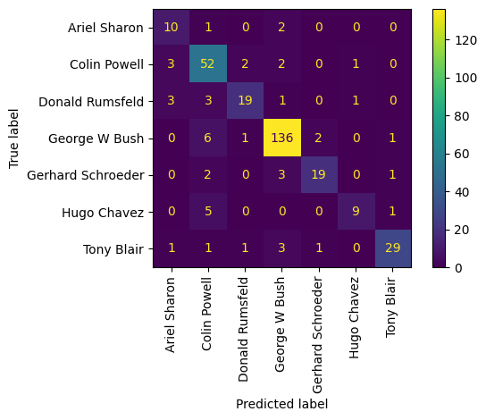

# Face Recognition with PCA and SVM

## n_components = 15




## n_components = 50




## n_components = 100


## n_components = 150



## n_components = 170




## n_components = 200


## n_components = 300


# Результати з консольного виводу
```
Total dataset size:
n_samples: 1288
n_features: 1850
n_classes: 7

Extracting the top 15 eigenfaces from 966 faces
done in 0.320s
Projecting the input data on the eigenfaces orthonormal basis
done in 0.024s

Fitting the classifier to the training set
done in 2.577s
Best estimator found by grid search:
SVC(C=np.float64(6733.990221937238), class_weight='balanced',
    gamma=np.float64(0.06446736635723009))

Predicting people's names on the test set
done in 0.006s
                   precision    recall  f1-score   support

     Ariel Sharon       0.44      0.54      0.48        13
     Colin Powell       0.74      0.70      0.72        60
  Donald Rumsfeld       0.37      0.52      0.43        27
    George W Bush       0.75      0.74      0.74       146
Gerhard Schroeder       0.50      0.44      0.47        25
      Hugo Chavez       0.54      0.47      0.50        15
       Tony Blair       0.47      0.42      0.44        36

         accuracy                           0.63       322
        macro avg       0.54      0.55      0.54       322
     weighted avg       0.64      0.63      0.64       322


Extracting the top 50 eigenfaces from 966 faces
done in 0.339s
Projecting the input data on the eigenfaces orthonormal basis
done in 0.021s

Fitting the classifier to the training set
done in 1.380s
Best estimator found by grid search:
SVC(C=np.float64(84788.09160746323), class_weight='balanced',
    gamma=np.float64(0.018747279987281446))

Predicting people's names on the test set
done in 0.010s
                   precision    recall  f1-score   support

     Ariel Sharon       0.90      0.69      0.78        13
     Colin Powell       0.83      0.92      0.87        60
  Donald Rumsfeld       0.80      0.59      0.68        27
    George W Bush       0.85      0.95      0.90       146
Gerhard Schroeder       0.82      0.72      0.77        25
      Hugo Chavez       1.00      0.67      0.80        15
       Tony Blair       0.93      0.78      0.85        36

         accuracy                           0.85       322
        macro avg       0.88      0.76      0.81       322
     weighted avg       0.86      0.85      0.85       322


Extracting the top 100 eigenfaces from 966 faces
done in 1.108s
Projecting the input data on the eigenfaces orthonormal basis
done in 0.037s

Fitting the classifier to the training set
done in 1.597s
Best estimator found by grid search:
SVC(C=np.float64(2939.814807847514), class_weight='balanced',
    gamma=np.float64(0.004308814512753072))

Predicting people's names on the test set
done in 0.013s
                   precision    recall  f1-score   support

     Ariel Sharon       0.62      0.77      0.69        13
     Colin Powell       0.78      0.90      0.84        60
  Donald Rumsfeld       0.78      0.67      0.72        27
    George W Bush       0.87      0.93      0.90       146
Gerhard Schroeder       0.81      0.68      0.74        25
      Hugo Chavez       1.00      0.53      0.70        15
       Tony Blair       0.86      0.69      0.77        36

         accuracy                           0.83       322
        macro avg       0.82      0.74      0.76       322
     weighted avg       0.84      0.83      0.83       322


Extracting the top 150 eigenfaces from 966 faces
done in 0.804s
Projecting the input data on the eigenfaces orthonormal basis
done in 0.042s

Fitting the classifier to the training set
done in 2.705s
Best estimator found by grid search:
SVC(C=np.float64(22007.254105186108), class_weight='balanced',
    gamma=np.float64(0.0029153807345001217))

Predicting people's names on the test set
done in 0.020s
                   precision    recall  f1-score   support

     Ariel Sharon       0.77      0.77      0.77        13
     Colin Powell       0.76      0.88      0.82        60
  Donald Rumsfeld       0.73      0.70      0.72        27
    George W Bush       0.91      0.95      0.93       146
Gerhard Schroeder       0.90      0.76      0.83        25
      Hugo Chavez       0.82      0.60      0.69        15
       Tony Blair       0.93      0.75      0.83        36

         accuracy                           0.86       322
        macro avg       0.83      0.77      0.80       322
     weighted avg       0.86      0.86      0.86       322


Extracting the top 170 eigenfaces from 966 faces
done in 0.861s
Projecting the input data on the eigenfaces orthonormal basis
done in 0.097s

Fitting the classifier to the training set
done in 2.627s
Best estimator found by grid search:
SVC(C=np.float64(4491.475345122027), class_weight='balanced',
    gamma=np.float64(0.0020440938683690566))

Predicting people's names on the test set
done in 0.022s
                   precision    recall  f1-score   support

     Ariel Sharon       0.59      0.77      0.67        13
     Colin Powell       0.74      0.87      0.80        60
  Donald Rumsfeld       0.83      0.70      0.76        27
    George W Bush       0.93      0.93      0.93       146
Gerhard Schroeder       0.86      0.76      0.81        25
      Hugo Chavez       0.82      0.60      0.69        15
       Tony Blair       0.91      0.81      0.85        36

         accuracy                           0.85       322
        macro avg       0.81      0.78      0.79       322
     weighted avg       0.86      0.85      0.85       322


Extracting the top 200 eigenfaces from 966 faces
done in 1.283s
Projecting the input data on the eigenfaces orthonormal basis
done in 0.102s

Fitting the classifier to the training set
done in 3.303s
Best estimator found by grid search:
SVC(C=np.float64(33102.75509409572), class_weight='balanced',
    gamma=np.float64(0.0017854759322690754))

Predicting people's names on the test set
done in 0.026s
                   precision    recall  f1-score   support

     Ariel Sharon       0.67      0.77      0.71        13
     Colin Powell       0.82      0.88      0.85        60
  Donald Rumsfeld       0.78      0.67      0.72        27
    George W Bush       0.90      0.95      0.93       146
Gerhard Schroeder       0.88      0.84      0.86        25
      Hugo Chavez       0.80      0.53      0.64        15
       Tony Blair       0.94      0.81      0.87        36

         accuracy                           0.86       322
        macro avg       0.83      0.78      0.80       322
     weighted avg       0.86      0.86      0.86       322


Extracting the top 300 eigenfaces from 966 faces
done in 1.371s
Projecting the input data on the eigenfaces orthonormal basis
done in 0.101s

Fitting the classifier to the training set
done in 3.985s
Best estimator found by grid search:
SVC(C=np.float64(19970.22040042102), class_weight='balanced',
    gamma=np.float64(0.0014187566443277138))

Predicting people's names on the test set
done in 0.033s
                   precision    recall  f1-score   support

     Ariel Sharon       0.60      0.46      0.52        13
     Colin Powell       0.72      0.90      0.80        60
  Donald Rumsfeld       0.94      0.59      0.73        27
    George W Bush       0.84      0.93      0.89       146
Gerhard Schroeder       1.00      0.72      0.84        25
      Hugo Chavez       0.78      0.47      0.58        15
       Tony Blair       0.81      0.72      0.76        36

         accuracy                           0.82       322
        macro avg       0.81      0.68      0.73       322
     weighted avg       0.83      0.82      0.81       322
```