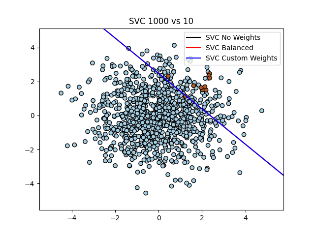
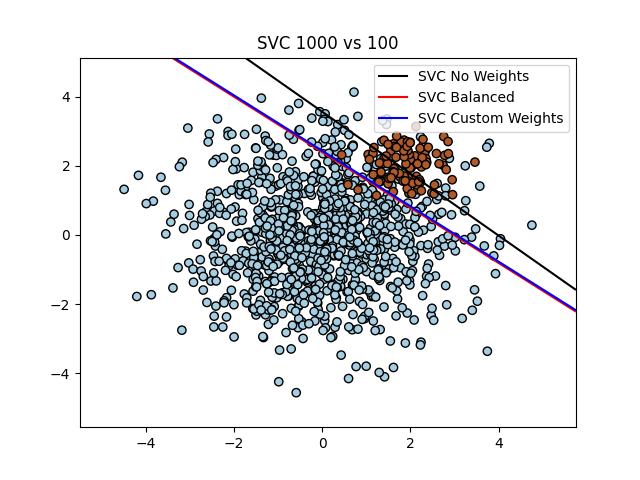
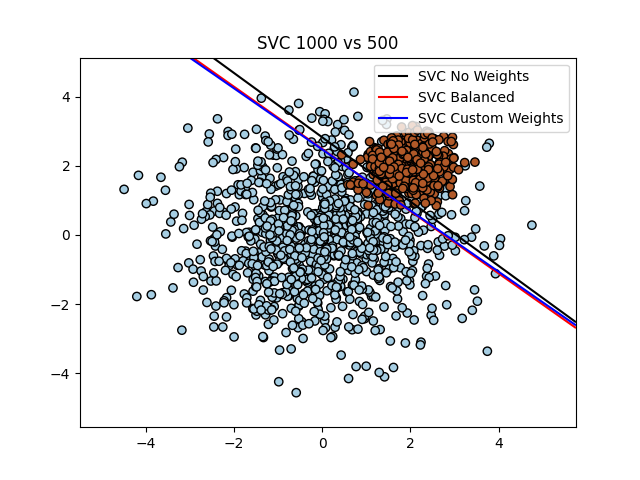
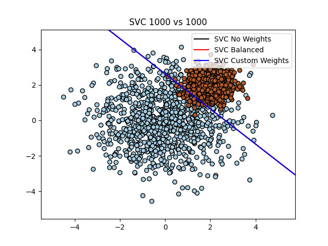
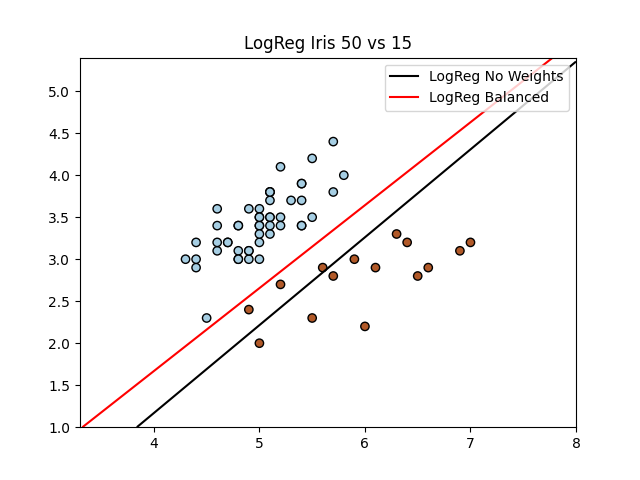
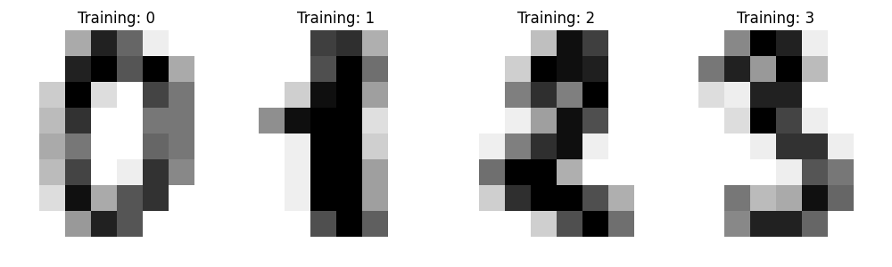
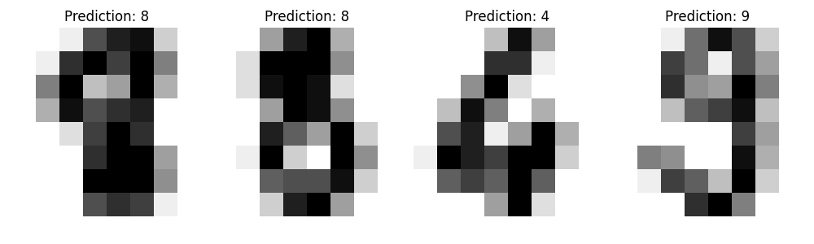
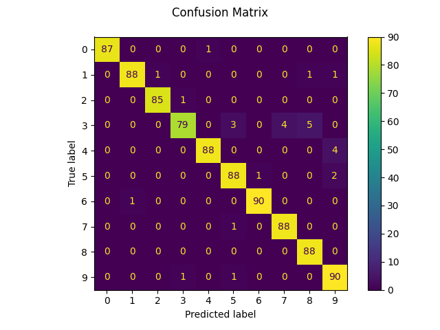

# Task 1

## SVM Classification with Different Class Imbalance Ratios






## Результати з консольного виводу
```
Experiment: class 0 = 1000, class 1 = 10
Classification Report (No weights):
              precision    recall  f1-score   support

           0       0.99      1.00      1.00       300
           1       0.00      0.00      0.00         3

    accuracy                           0.99       303
   macro avg       0.50      0.50      0.50       303
weighted avg       0.98      0.99      0.99       303


Classification Report (Balanced):
              precision    recall  f1-score   support

           0       1.00      0.90      0.95       300
           1       0.09      1.00      0.16         3

    accuracy                           0.90       303
   macro avg       0.54      0.95      0.55       303
weighted avg       0.99      0.90      0.94       303


Classification Report (Custom {0: 1, 1: 100}):
              precision    recall  f1-score   support

           0       1.00      0.90      0.95       300
           1       0.09      1.00      0.16         3

    accuracy                           0.90       303
   macro avg       0.54      0.95      0.55       303
weighted avg       0.99      0.90      0.94       303


Experiment: class 0 = 1000, class 1 = 100
Classification Report (No weights):
              precision    recall  f1-score   support

           0       0.96      0.97      0.97       300
           1       0.67      0.60      0.63        30

    accuracy                           0.94       330
   macro avg       0.81      0.78      0.80       330
weighted avg       0.93      0.94      0.93       330


Classification Report (Balanced):
              precision    recall  f1-score   support

           0       0.99      0.91      0.95       300
           1       0.52      0.93      0.67        30

    accuracy                           0.92       330
   macro avg       0.76      0.92      0.81       330
weighted avg       0.95      0.92      0.93       330


Classification Report (Custom {0: 1, 1: 10}):
              precision    recall  f1-score   support

           0       0.99      0.91      0.95       300
           1       0.52      0.93      0.67        30

    accuracy                           0.92       330
   macro avg       0.76      0.92      0.81       330
weighted avg       0.95      0.92      0.93       330


Experiment: class 0 = 1000, class 1 = 500
Classification Report (No weights):
              precision    recall  f1-score   support

           0       0.96      0.93      0.94       300
           1       0.86      0.92      0.89       150

    accuracy                           0.92       450
   macro avg       0.91      0.92      0.92       450
weighted avg       0.93      0.92      0.93       450


Classification Report (Balanced):
              precision    recall  f1-score   support

           0       0.97      0.91      0.94       300
           1       0.84      0.95      0.89       150

    accuracy                           0.92       450
   macro avg       0.91      0.93      0.92       450
weighted avg       0.93      0.92      0.92       450


Classification Report (Custom {0: 1, 1: 2}):
              precision    recall  f1-score   support

           0       0.97      0.91      0.94       300
           1       0.84      0.95      0.89       150

    accuracy                           0.92       450
   macro avg       0.91      0.93      0.92       450
weighted avg       0.93      0.92      0.92       450


Experiment: class 0 = 1000, class 1 = 1000
Classification Report (No weights):
              precision    recall  f1-score   support

           0       0.96      0.91      0.93       300
           1       0.91      0.97      0.94       300

    accuracy                           0.94       600
   macro avg       0.94      0.94      0.94       600
weighted avg       0.94      0.94      0.94       600


Classification Report (Balanced):
              precision    recall  f1-score   support

           0       0.96      0.91      0.93       300
           1       0.91      0.97      0.94       300

    accuracy                           0.94       600
   macro avg       0.94      0.94      0.94       600
weighted avg       0.94      0.94      0.94       600


Classification Report (Custom {0: 1, 1: 1}):
              precision    recall  f1-score   support

           0       0.96      0.91      0.93       300
           1       0.91      0.97      0.94       300

    accuracy                           0.94       600
   macro avg       0.94      0.94      0.94       600
weighted avg       0.94      0.94      0.94       600
```

# Task 2

## Logistic Regression: Iris Dataset with Class Imbalance



## Результати з консольного виводу
```
Classification Report (No weights):
              precision    recall  f1-score   support

           0       0.88      1.00      0.94        15
           1       1.00      0.60      0.75         5

    accuracy                           0.90        20
   macro avg       0.94      0.80      0.84        20
weighted avg       0.91      0.90      0.89        20


Classification Report (Balanced):
              precision    recall  f1-score   support

           0       1.00      1.00      1.00        15
           1       1.00      1.00      1.00         5

    accuracy                           1.00        20
   macro avg       1.00      1.00      1.00        20
weighted avg       1.00      1.00      1.00        20
```

# Task 3

## SVM Classification on Digits Dataset





## Результати з консольного виводу
```
Classification report for classifier SVC(gamma=0.001):
              precision    recall  f1-score   support

           0       1.00      0.99      0.99        88
           1       0.99      0.97      0.98        91
           2       0.99      0.99      0.99        86
           3       0.98      0.87      0.92        91
           4       0.99      0.96      0.97        92
           5       0.95      0.97      0.96        91
           6       0.99      0.99      0.99        91
           7       0.96      0.99      0.97        89
           8       0.94      1.00      0.97        88
           9       0.93      0.98      0.95        92

    accuracy                           0.97       899
   macro avg       0.97      0.97      0.97       899
weighted avg       0.97      0.97      0.97       899


Confusion matrix:
[[87  0  0  0  1  0  0  0  0  0]
 [ 0 88  1  0  0  0  0  0  1  1]
 [ 0  0 85  1  0  0  0  0  0  0]
 [ 0  0  0 79  0  3  0  4  5  0]
 [ 0  0  0  0 88  0  0  0  0  4]
 [ 0  0  0  0  0 88  1  0  0  2]
 [ 0  1  0  0  0  0 90  0  0  0]
 [ 0  0  0  0  0  1  0 88  0  0]
 [ 0  0  0  0  0  0  0  0 88  0]
 [ 0  0  0  1  0  1  0  0  0 90]]


Classification report rebuilt from confusion matrix:
              precision    recall  f1-score   support

           0       1.00      0.99      0.99        88
           1       0.99      0.97      0.98        91
           2       0.99      0.99      0.99        86
           3       0.98      0.87      0.92        91
           4       0.99      0.96      0.97        92
           5       0.95      0.97      0.96        91
           6       0.99      0.99      0.99        91
           7       0.96      0.99      0.97        89
           8       0.94      1.00      0.97        88
           9       0.93      0.98      0.95        92

    accuracy                           0.97       899
   macro avg       0.97      0.97      0.97       899
weighted avg       0.97      0.97      0.97       899
```