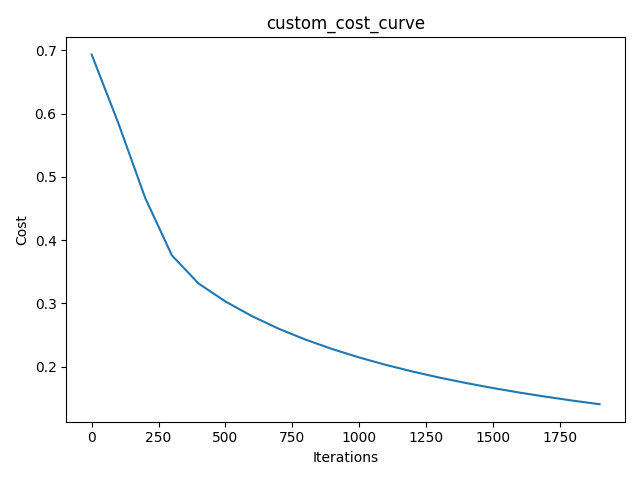
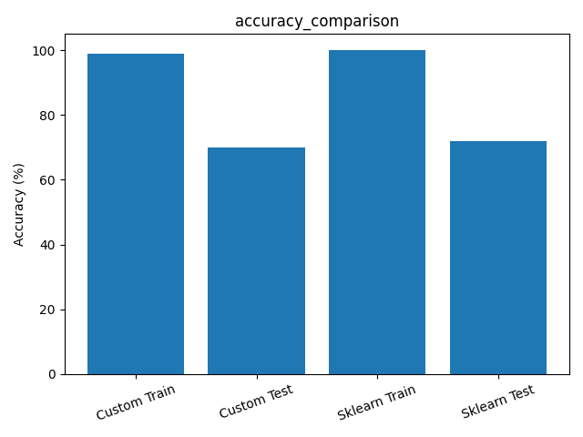
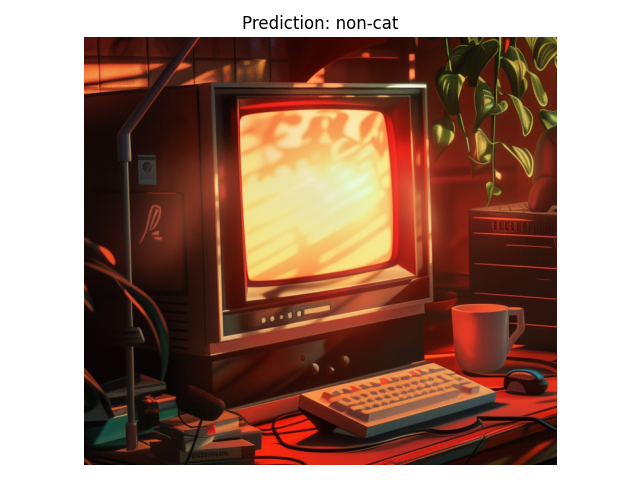
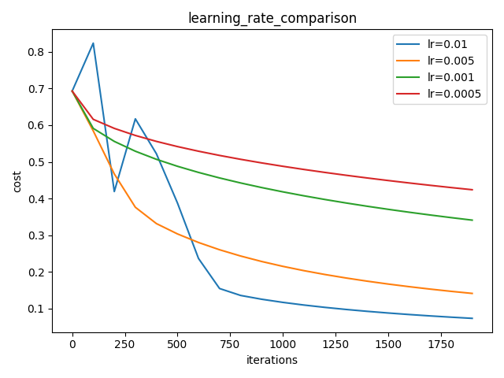
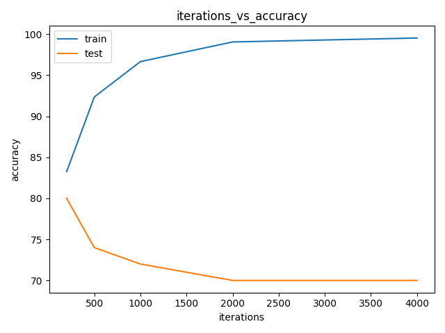

# Task 1

## Custom vs Sklearn Logistic Regression




## Custom Logistic Regression prediction on custom image


## Результати з консольного виводу
```
Custom model train accuracy: 99.04%
Custom model test accuracy: 70.00%

Sklearn model train accuracy: 100.00%
Sklearn model test accuracy: 72.00%

y = 0.4462628618863666, your algorithm predicts a "non-cat" picture.
```

# Task 2

## Learning Rate and Iterations Analysis




## Результати з консольного виводу
```
lr=0.01 train=99.52% test=70.00%
lr=0.005 train=99.04% test=70.00%
lr=0.001 train=91.39% test=68.00%
lr=0.0005 train=86.60% test=62.00%

iter=200 train=83.25% test=80.00%
iter=500 train=92.34% test=74.00%
iter=1000 train=96.65% test=72.00%
iter=2000 train=99.04% test=70.00%
iter=4000 train=99.52% test=70.00%
```